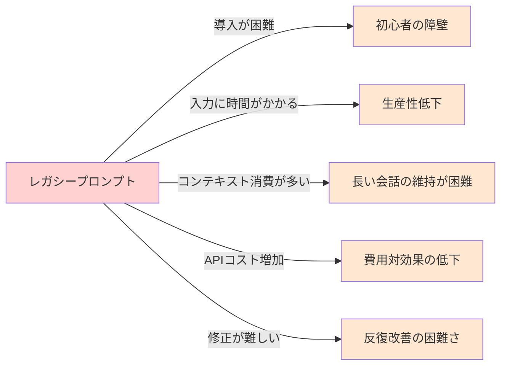
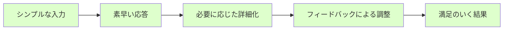

## 第2章：現代のAIモデルの理解

### 2.1 AIの進化：何が変わったのか

最新の生成AIモデルは、初期のモデルとは大きく異なります。特に以下の点で進化しています：

- **コンテキスト理解の向上**: より自然な会話の流れを理解できるようになった
- **暗黙の意図の把握**: 明示的に述べられていないニュアンスも捉えられるようになった
- **推論能力の向上**: 複雑な思考プロセスを要する課題にも対応可能に
- **多様な表現スタイル**: 様々な文体やトーンでの応答が可能に
- **多言語能力の向上**: 日本語を含む非英語言語での理解・生成能力が飛躍的に向上

> **コラム：「過去の呪文で縛られる現代の魔法使い」**
> 
> 先日、大手企業のDX推進部門の方と話す機会がありました。その方は「ChatGPTの使い方」という分厚いマニュアルを見せてくれました。2022年末に作られたそのマニュアルには、びっしりとプロンプトテンプレートが書かれています。「このマニュアルに従わないと使いこなせない」と真剣に語る姿を見て、少し切なくなりました。それは、スマートフォンを使うのに2010年の操作マニュアルに固執しているようなものです。テクノロジーは進化しているのに、私たちの使い方が追いついていないのです。古い呪文に縛られた魔法使いは、新しい魔法の力を十分に発揮できないのかもしれません。

以下は、2022年と2025年のAIモデルへの同じ質問に対する応答の違いを示す例です：

**＜ケーススタディ＞2022年と2025年のAIの応答比較**

```
# 2022年のプロンプト：
You are an expert marketing strategist. I want you to create a comprehensive marketing plan 
for a new coffee shop in Tokyo. The plan should include target audience analysis, 
competitive landscape, promotional strategies, budget allocation, and timeline for implementation. 
Be detailed and specific.

# 日本語訳：
あなたは専門のマーケティング戦略家です。東京の新しいコーヒーショップのための包括的な
マーケティング計画を作成してください。計画にはターゲット層分析、競合状況、
プロモーション戦略、予算配分、実施タイムラインを含めてください。
詳細かつ具体的にしてください。
```

```
# 2025年のプロンプト：
東京で新しいコーヒーショップを開くんだけど、マーケティングプランを考えてもらえる？
```

2022年のAIは詳細な指示がなければ具体的なプランを生成できませんでしたが、2025年のAIは簡潔な依頼からでも充実した内容を提供できます。過度に詳細な指示は、むしろAIの創造性を制限することさえあるのです。

### 2.2 現代のAIが実際に「理解」していること

最新のAIモデルは以下のような高度な理解が可能です：

- **文脈の継続的把握**: 長い会話の中でも一貫性を保てる
- **暗黙的な期待の認識**: 明示されていない要求も推測できる
- **ドメイン知識の適用**: 特定分野の専門知識を適切に活用できる
- **ユーザーの意図の推測**: 不明確な指示でもおおよその意図を把握できる
- **文化的コンテキストの理解**: 日本語特有の曖昧さや婉曲表現の意図を汲み取れる

> **コラム：「AIの成長を見逃すおじさん現象」**
> 
> 私の上司（50代）は、AIに対する最初の失敗体験から抜け出せない典型例です。2022年末に初めてChatGPTを使った時、簡単な質問をしたら的外れな回答が返ってきました。それ以来「AIはまだ使い物にならない」と決めつけ、同僚が勧めても「前に試したけど、ダメだった」の一点張り。子どもの成長を数年見ないうちに「まだあの子は小さい」と思い込むおじさんのようです。テクノロジーの進化速度は私たちの認識更新速度をはるかに上回っています。一度形成された先入観を更新し続けることが、AI時代を生き抜くための重要なスキルかもしれません。

### 2.3 AIモデルの能力マッピング

現代のAIモデルの能力を理解するために、どのような能力が向上したのかを可視化してみましょう。

```mermaid
radar
    title AIモデル能力の進化（2022年→2025年）
    %% スケールは0～10で表示
    %% 内側から外側に：初期モデル→現代モデル
    %% コンテキスト理解
    Context Understanding: 4, 9
    %% 暗黙の意図理解
    Implied Intent: 3, 8
    %% 創造性
    Creativity: 5, 8
    %% 指示への忠実さ
    Instruction Following: 7, 9
    %% 推論能力
    Reasoning: 4, 8
    %% 多言語能力
    Multilingual: 5, 8
    %% 知識の正確さ
    Knowledge Accuracy: 6, 8
    %% 文化的理解
    Cultural Understanding: 3, 7
```

この図からも分かるように、初期モデルは指示に忠実に従うことは得意でしたが、暗黙の意図理解や創造性、文化的理解などは限定的でした。現代のモデルはこれらの能力が大幅に向上し、より自然なコミュニケーションが可能になっています。

## 第3章：レガシープロンプトの問題点

### 3.1 過度な指示が創造性を殺す

レガシープロンプトの最大の問題点は、AIの創造性と思考の幅を狭めてしまうことにあります。

**＜ケーススタディ＞小説の書き出し比較**

```
# レガシープロンプト：
You are a professional novelist specialized in mystery fiction. Write the opening paragraph 
of a mystery novel set in Kyoto during cherry blossom season. The paragraph must include 
a female protagonist, a hint of a murder, and atmospheric description of the setting. 
Use vivid sensory details and create an ominous tone. The paragraph should be between 150-200 words.

# 日本語訳：
あなたはミステリー小説を専門とするプロの小説家です。桜の季節の京都を舞台にした
ミステリー小説の冒頭段落を書いてください。段落には女性の主人公、殺人の暗示、
雰囲気のある舞台設定の描写を含める必要があります。鮮やかな感覚的詳細を使用し、
不吉な調子を作り出してください。段落は150〜200語の間にしてください。

# 現代的プロンプト：
京都の桜の季節を舞台にした、ミステリー小説の冒頭を書いてみて
```

> **コラム：「小説家の制約と自由」**
> 
> 私は趣味で小説を書いていますが、AIを執筆補助に使い始めてから気づいたことがあります。最初は「こういう登場人物で、こういう設定で、こういう展開にして」と細かく指定していました。その結果、技術的には問題ないものの、どこか生気のない文章が返ってきました。試しに「30代の女性が突然異世界に行くお話の書き出し、お願い」と大雑把に頼んでみると、思いもよらない展開や設定が提案されました。プロの小説家の友人は「制約は創造性を高める場合もあるが、過度な制約は創造性を窒息させる」と言います。AIも同じなのかもしれません。私のような素人が考えつかないアイデアをAIが提案してくれることがあり、そこから発想を広げることができます。指示しすぎないことで、AIの創造性を活かせるのです。

### 3.2 冗長性と非効率性

レガシープロンプトのもう一つの問題点は、不必要に長く複雑であることです。

例えば：

```
# レガシープロンプト：
You are an expert chef with 20 years of experience in Italian cuisine. I want you to create a detailed recipe 
for an authentic Italian pasta dish that is suitable for beginners, uses ingredients that are readily available 
in regular supermarkets in Japan, takes less than 45 minutes to prepare, and has a unique twist that makes it 
stand out from common recipes. Include a list of all ingredients with precise measurements, step-by-step cooking 
instructions, potential substitutions for dietary restrictions, and tips for presentation.

# 日本語訳：
あなたはイタリア料理で20年の経験を持つ専門シェフです。初心者に適した本格的なイタリアンパスタ料理の
詳細なレシピを作成してください。日本の一般的なスーパーマーケットで簡単に入手できる材料を使用し、
準備に45分未満かかり、一般的なレシピとは一線を画すユニークなひねりを加えてください。
正確な測定値を含むすべての材料のリスト、ステップバイステップの調理手順、食事制限に対する
潜在的な代替品、プレゼンテーションのためのヒントを含めてください。

# 現代的プロンプト：
日本のスーパーで買える材料で作れる、初心者向けの少し変わったイタリアンパスタのレシピを教えて
```

AIは「初心者向け」「イタリアン」「パスタ」「レシピ」「日本のスーパー」「少し変わった」というキーワードから必要なコンテキストを理解し、適切な応答を生成できます。長い前置きや細かい指定は、多くの場合不要なのです。

> **コラム：「企画書の呪縛」**
> 
> マーケティング部門で働く友人は、AIを使って企画書のドラフトを作成する際に面白い発見をしました。当初は「企画書テンプレート」として保存していた1000字を超える詳細なプロンプトを使っていましたが、ある日急いでいて「新商品のSNSキャンペーン企画、ターゲットは20代女性、美容と健康に関心あり」と簡潔に入力したところ、いつも以上に斬新なアイデアが含まれた企画書が返ってきたのです。彼女が気づいたのは、詳細すぎる指示が「前例踏襲バイアス」を生んでいたこと。AIに与える自由度を高めることで、人間が思いつかなかった切り口が提案されるようになりました。今では企画の初期段階ではあえてシンプルなプロンプトを使い、アイデアの幅を広げる戦略を取っているそうです。

### 3.3 ユーザー体験の低下

冗長なプロンプトは、AI利用のユーザー体験を大きく低下させます：

1. **入力の手間**: 長文を入力するのは時間がかかる
2. **コンテキスト消費**: 長いプロンプトはコンテキストウィンドウを消費する
3. **修正の困難さ**: 詳細なプロンプトは微調整が難しい
4. **応答時間の増加**: 長いプロンプトは処理時間が長くなる
5. **コスト増加**: APIを使用する場合、トークン数に応じて料金が発生



> **コラム：「プロンプト作成に1時間、AIとの対話に5分」**
> 
> あるマーケティング会議で、同僚がAIを使って市場分析を行うというデモンストレーションを行いました。彼は「効果的なプロンプトの作成」について15分間説明した後、画面共有で実際のプロンプトを入力し始めました。下書きしておいたWord文書から500字以上のテキストをコピー＆ペーストし、さらに5分かけて微調整。ようやくAIに送信したところで「このプロンプトの準備に1時間かかりました」と誇らしげに語りました。AIの回答は確かに良質でしたが、会議後、別の同僚が小声で「あんな準備をするなら、自分で分析した方が早いのでは？」とつぶやいていました。これこそレガシープロンプトの本質的な問題です。AI活用の本来の目的は効率化なのに、プロンプト作成自体が非効率な作業になってしまうのです。

## 第4章：現代的プロンプトの原則

### 4.1 シンプルから始める

現代的なプロンプト設計の第一原則は「シンプルから始める」ことです。

- まずは最もシンプルな形で質問や依頼を表現する
- 必要に応じて詳細を追加していく
- AIの応答を見て、方向性の調整や詳細化を行う

人間同士の自然な会話と同じように、一度にすべてを伝えようとするのではなく、対話を通じて徐々に意図を明確にしていく方がより効果的です。

```
# レガシーアプローチ
You are a professional data analyst with expertise in Python and data visualization. 
I want you to analyze the following sales data for a retail company. 
The data includes monthly sales figures for the past 3 years across 5 different product categories. 
Please provide a comprehensive analysis including trends, seasonality, growth rates by category, 
and identify the best and worst performing products. Include Python code for data processing 
and visualization using matplotlib and seaborn. The visualizations should include line charts 
for trends, bar charts for category comparisons, and heatmaps for correlation analysis.

# 現代的アプローチ
この小売業の売上データを分析してもらえる？
（AIの応答を見てから）
季節性と商品カテゴリごとの傾向も見たいな
（さらに応答を見て）
可視化するためのPythonコードも添えてくれる？
```

> **コラム：「AIとの会話は人間との会話に似ている」**
> 
> 先日、70代の母がAIを初めて使う様子を見ていて気づいたことがあります。「どうやって話しかけたらいいの？」と聞くので、「普通に話しかければいいよ」と答えると、母は信じられないという表情でした。彼女がパソコンを使い始めた時代は、コンピュータに正確なコマンドを入力しないと動かなかった時代。「えっと...レシピを...教えてください...カレー...簡単な...」と途切れ途切れに入力していました。数回のやり取りを見ていると、徐々に自然な会話調になっていきました。最後には「あら、本当に普通に話せるのね」と驚いていました。母のこの体験は、多くの人がAIに対して持つ先入観を表しています。新しいテクノロジーには新しい対話方法が必要だと思い込んでいるのです。実際には、AIとの対話は人間同士の自然な会話に近づいているのです。

### 4.2 対話的アプローチ

現代のAIとの対話は、一方的な指示ではなく双方向のコミュニケーションです。

**対話的プロンプトの例：**

```
1. ユーザー：「マーケティング計画の作成を手伝ってほしい」
2. AI：「どのような商品やサービスのマーケティング計画ですか？」
3. ユーザー：「うちの会社はエコ商品を扱ってるから、その点を強調したいな」
4. AI：（エコフレンドリーな要素を取り入れた計画の概要を提案）
5. ユーザー：「ターゲット層はもう少し若い世代に絞りたいかも」
6. AI：（若年層向けの要素を追加・調整した計画を提案）
```

このように段階的に情報を提供し、AIの応答を見ながら方向性を微調整していくアプローチは、一度に完璧なプロンプトを作成しようとするよりも効率的で、より満足度の高い結果につながります。

> **コラム：「最高の料理人と最高の注文の仕方」**
> 
> 私の友人は高級寿司店のカウンターで調理する寿司職人です。彼が言うには、最高の食事体験を得るお客様は大きく二つのタイプに分かれるそうです。一つは「おまかせで」と言って職人の腕を信頼するタイプ。もう一つは「今日はこんな気分です」と自分の好みや気分を伝えつつも、具体的な内容は職人に委ねるタイプ。逆に最も満足度が低くなりがちなのは、最初から最後まで細かく指定するお客様だそうです。「この魚をこう切って、この調味料でこう味付けして」と指示されると、職人の創造性や経験が活かせないからです。AIとの対話も同じではないでしょうか。最高の結果を得るには、AIの「腕前」を信頼し、方向性や好みは伝えつつも、細部まで指示しすぎないことが重要なのかもしれません。

### 4.3 AIの強みを活かす

現代的プロンプトの重要な視点は、AIの強みを理解し活用することです。

- **生成的思考**: AIに選択肢や可能性を広げる余地を与える
- **情報の構造化**: 大量の情報を整理・分類する能力を活用する
- **多様な視点の提供**: 異なる観点からの検討を依頼する
- **反復的改善**: フィードバックを通じて回答を洗練させる

**＜ケーススタディ＞問題解決アプローチの比較**

```
# レガシープロンプト：
You are a strategic problem solver. I want you to analyze the issue of high employee turnover 
in a tech company using the following frameworks: SWOT analysis, 5 Whys, and Fishbone diagram. 
For each framework, provide a detailed analysis with at least 5 points per category. 
Then synthesize your findings into a comprehensive action plan with immediate, short-term, 
and long-term recommendations.

# 日本語訳：
あなたは戦略的な問題解決者です。SWOT分析、5つのなぜ、特性要因図の枠組みを使用して、
テクノロジー企業における従業員の高い離職率の問題を分析してください。それぞれの枠組みに対して、
カテゴリごとに少なくとも5つのポイントを含む詳細な分析を提供してください。
次に、即時、短期、長期の推奨事項を含む包括的なアクションプランにあなたの調査結果を統合してください。

# 現代的プロンプト：
IT企業の離職率が高いんだけど、この問題をいろんな角度から分析してみてくれる？
```

現代的なアプローチでは、AIに分析の枠組みを選ばせることで、より適切で創造的な解決策が生まれる可能性が高まります。

### 4.4 ユーザー体験を優先する

現代的プロンプトの重要な視点は、AIとの対話全体のユーザー体験（UX）を向上させることです。



この流れは、一度に完璧なプロンプトを作成しようとするアプローチよりも、全体としてより少ない時間と労力で、より満足度の高い結果につながります。

> **コラム：「AIプロンプトのアジャイル開発」**
> 
> ソフトウェア開発では、かつての「ウォーターフォール型」（全てを事前に完璧に計画する）から「アジャイル型」（小さく始めて反復的に改善する）への移行が起きました。AIプロンプトにも同じパラダイムシフトが起きています。私のチームでは「プロンプトのアジャイル開発」と呼んでいますが、最初は最小限のプロンプトから始め、AIの応答を見ながら対話的に改良していくアプローチです。これにより、想定外の良いアイデアが生まれたり、より効率的に目的を達成できたりすることが多いのです。レガシープロンプトの長大な「仕様書」作成に時間をかけるよりも、小さく始めて素早くフィードバックを得るサイクルの方が、結果的に優れた成果につながっています。

## 第5章：レガシープロンプトが適している場面

すべての場面で現代的プロンプトが優れているわけではありません。レガシープロンプトが依然として有効、あるいは必要な状況もあります。

### 5.1 精度と一貫性が最重要の場合

- **法的文書や契約書の作成**
- **医療情報や安全手順の説明**
- **技術的なマニュアルや手順書**
- **財務レポートや監査文書**

これらの場合、AIに創造的な自由度を与えるよりも、厳密な枠組みを提供する方が適切です。

```
# この場合は詳細な指示が適切
あなたは医療文書の専門家です。糖尿病患者向けの血糖値管理ガイドラインを作成してください。
以下の要素を必ず含めてください：
1. 血糖値の正常範囲と危険値
2. 測定の頻度と適切なタイミング
3. 低血糖症状とその対処法
4. 高血糖症状とその対処法
5. 医師に連絡すべき緊急事態の基準
6. 食事と運動の記録方法
文書は医学的に正確でなければならず、最新の臨床ガイドラインに準拠している必要があります。
専門用語は必要最小限にし、一般の患者でも理解できる平易な表現を使用してください。
```

> **コラム：「精度が命の場面」**
> 
> 医療系のテクニカルライターとして働く知人は、AIを使って患者向け説明資料の下書きを作成しています。彼女によると「この分野では曖昧さが許されない」とのこと。投薬量や副作用の説明などでは、言葉選びひとつで患者の健康や生命に関わるため、詳細かつ明確な指示が必須だそうです。彼女は「創造性より正確さ」を重視し、医学用語の定義や表現方法をプロンプトで細かく指定します。この例は、AIの用途や目的によって最適なプロンプト戦略が異なることを教えてくれます。一方で、患者向けの病気の理解を助ける比喩や説明例を考える際には、AIに自由度を与える方がより分かりやすく印象に残る表現が得られると言います。同じ医療分野でも、目的によってプロンプト戦略を使い分けているのです。

### 5.2 特殊なフォーマットやスタイルの指定

特定のフォーマットに厳密に従う必要がある場合、詳細な指示が有効です：

- **特定の引用スタイル（APA、MLA、Chicagoなど）の使用**
- **企業の特定のブランドガイドラインへの準拠**
- **厳格な文字数制限のある文書**
- **特定の構造や専門的なフォーマットが要求される文書**

```
# フォーマットが重要な場合のプロンプト例
次の研究論文の要約をAPA形式で引用を含めて作成してください。
各セクションは200字以内にまとめ、キーワードを5つ含めてください。
論文タイトル：「人工知能を活用した教育パーソナライゼーションの効果：日本の高等教育機関における実証研究」
著者：山田太郎、鈴木花子
発行年：2023
ジャーナル：Journal of Educational Technology
巻（号）：45(3)
ページ：123-145
DOI：10.1234/jet.2023.45.3.123
```

### 5.3 バイアスの最小化が必要な場合

センシティブなトピックを扱う際、AIのバイアスを減らすために明示的な指示が役立つことがあります：

- **政治的なトピックの中立的分析**
- **多様な視点を含むべき社会問題の説明**
- **文化的センシティビティが求められる内容**
- **論争のある話題についての均衡の取れた議論**

> **コラム：「レガシーとモダンの使い分けの妙」**
> 
> 大手