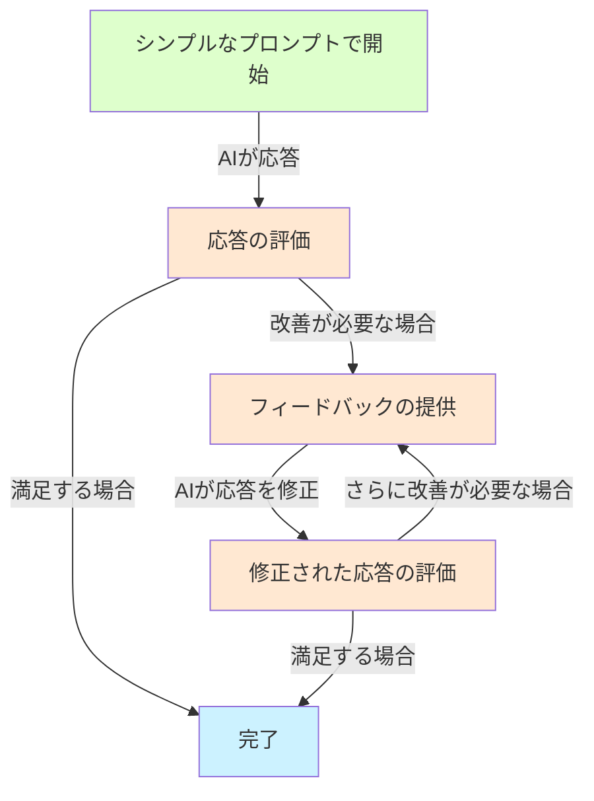
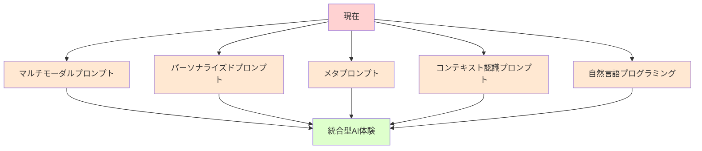

> **コラム：「レガシーとモダンの使い分けの妙」**
> 
> 大手広告代理店でコピーライターとして働く友人は、AIの活用法にこだわりを持っています。クライアントの業界分析や背景調査ではシンプルなプロンプトを使い、AIの知識と推論能力を最大限に活用。一方、法的な免責事項や規制業界（医薬品、金融など）の広告文を作成する際は、業界特有の表現ルールや禁止ワードを細かく指定した詳細なプロンプトを使用します。「AIは共同作業者であり、状況に応じてコミュニケーション方法を変えるのは当然」と彼女は言います。これこそが現代のAI活用の本質なのかもしれません。固定的な「正しいプロンプト」を追求するのではなく、目的や状況に応じて柔軟に使い分けることが大切なのです。

## 第6章：効果的な現代的プロンプトの実践例

### 6.1 ビジネス領域での応用

**企画会議のアイデア出し**

```
# レガシープロンプト：
You are an experienced innovation consultant with expertise in design thinking. 
Generate 10 innovative product ideas for a sustainable kitchenware brand targeting millennials. 
Each idea should include a product name, key features, unique selling proposition, 
potential price point, and ecological benefits. Ensure the ideas are feasible to manufacture, 
aligned with current market trends, and solve real problems faced by the target demographic.

# 日本語訳：
あなたは設計思考に関する専門知識を持つ経験豊富なイノベーションコンサルタントです。
ミレニアル世代をターゲットにした持続可能なキッチンウェアブランドのための10の革新的な
製品アイデアを生成してください。各アイデアには、製品名、主な機能、独自の販売提案、
潜在的な価格帯、および生態学的利点を含める必要があります。アイデアが製造可能であり、
現在の市場トレンドに沿っており、ターゲット層が直面する実際の問題を解決することを確認してください。

# 現代的プロンプト：
ミレニアル世代向けのサステナブルなキッチン用品のアイデアをブレストしたいんだけど
```

**＜ケーススタディ＞実際の企業での導入結果**

あるデザイン会社では、週次のアイデア会議でLLMを活用していましたが、当初は詳細なプロンプトテンプレートを使用していました。しかし、シンプルなプロンプトに切り替えたところ、会議の準備時間が75%削減され、より多様で予想外のアイデアが生まれるようになりました。

> **コラム：「テンプレ依存症からの解放」**
> 
> IT企業で働く私の友人は、プロジェクト提案書の作成でAIを活用していましたが、常に同じテンプレートを使い続けていました。ある日「このテンプレート、結局いつも同じような提案になってない？」と気づき、試しに「クラウドセキュリティ強化のための革新的なアプローチを考えて」とシンプルに尋ねてみました。すると、テンプレートでは出てこなかった斬新なアイデアが返ってきたのです。「テンプレートが思考の型枠になっていた」と彼は言います。シンプルなプロンプトによって、AIだけでなく自分自身の発想の幅も広がったと感じたそうです。現在は、最初のアイデア出しではあえてシンプルに問いかけ、その後で必要に応じて詳細を指定するハイブリッドアプローチを取っています。このように、プロンプトの進化は私たちの思考プロセスの進化にもつながるのです。

### 6.2 教育現場での応用

**授業計画の作成**

```
# レガシープロンプト：
You are an experienced high school science teacher with a specialization in biology. 
Create a detailed lesson plan for a 60-minute class on photosynthesis for 10th grade students. 
The plan should include learning objectives aligned with national science standards, 
a warm-up activity (5-10 minutes), main instructional content with key concepts and scientific terminology, 
an interactive student activity, assessment methods, and homework assignment. 
Include timing for each section, required materials, and accommodations for different learning styles.

# 日本語訳：
あなたは生物学を専門とする経験豊富な高校の理科教師です。
高校2年生向けの光合成に関する60分の授業の詳細な指導案を作成してください。
計画には、全国科学基準に沿った学習目標、ウォームアップ活動（5〜10分）、
主要な概念と科学用語を含む主要な指導内容、インタラクティブな生徒活動、
評価方法、および宿題の割り当てを含める必要があります。
各セクションのタイミング、必要な材料、および異なる学習スタイルへの対応を含めてください。

# 現代的プロンプト：
高校2年生に光合成について教える授業案を考えてるんだけど、アイデアある？
```

シンプルなプロンプトから始め、AIの提案を見ながら「もう少し実験的な要素を入れたい」「覚えやすい比喩があるといいな」など対話的に発展させることで、より創造的で実践的な授業計画が生まれます。

> **コラム：「教育者のAI活用術」**
> 
> 高校で生物を教えている知人は、当初AIを使う際に「完璧な授業計画」を一発で得ようとしていました。彼女のプロンプトは学習指導要領の項目を全て列挙し、授業の流れを細かく指定するもので、入力だけで15分ほどかかっていたそうです。しかし、ある研修会でシンプルなプロンプトから始めて対話的にアイデアを発展させる方法を学んでから、彼女のAI活用法は大きく変わりました。「以前は既存の授業案の焼き直しになりがちだったけど、今はAIとの対話から思いもよらないアクティビティのアイデアが生まれる」と彼女は言います。特に印象的だったのは、光合成の授業で「スマホのバッテリーと太陽エネルギーの比較」という導入を提案されたこと。生徒の身近な経験と結びつけることで、抽象的な概念への興味を引き出すことができたそうです。シンプルな問いかけから始めることで、AIの創造性と教育者の専門知識が融合した、より効果的な学習体験が生まれているのです。

### 6.3 創造的分野での応用

**小説執筆のサポート**

```
# レガシープロンプト：
You are a professional fiction editor with expertise in character development. 
Analyze the protagonist in my novel draft and provide detailed feedback on their character arc, 
motivations, internal conflicts, external obstacles, growth trajectory, and believability. 
Identify specific scenes where character development could be strengthened and suggest revisions 
that would enhance reader engagement while maintaining consistency with the established character traits. 
Provide at least 3 examples of successful character development from bestselling novels in the same genre for comparison.

# 日本語訳：
あなたはキャラクター開発の専門知識を持つプロの小説編集者です。
私の小説の草稿の主人公を分析し、キャラクターの弧、動機、内部葛藤、外部障害、
成長軌跡、信頼性について詳細なフィードバックを提供してください。
キャラクター開発を強化できる特定のシーンを特定し、確立されたキャラクターの特性との
一貫性を維持しながら読者の関与を高める改訂を提案してください。
比較のために、同じジャンルのベストセラー小説からの成功したキャラクター開発の例を少なくとも3つ提供してください。

# 現代的プロンプト：
書いてる小説の主人公がどうも平面的に感じるんだけど、もっと魅力的にする方法ない？
```

創造的な作業では特に、AIに具体的なアイデアや選択肢を考える余地を与えることで、執筆者自身が思いつかなかった視点や解決策が提示されることがあります。

> **コラム：「作家とAIの共創空間」**
> 
> あるミステリー作家の友人は、AIとの対話方法を変えたことで創作の行き詰まりを打破したと話してくれました。以前は「ミステリー小説のプロットを考えて、以下の要素を含めること：女性探偵、閉鎖的な島の村、古い呪いの伝説...」といった具体的な指示をしていましたが、得られるのは既存の作品の組み合わせのような平凡なプロットばかり。しかし「探偵小説を書いていて、意外性のあるトリックを思いつかないんだけど」というシンプルな悩みを投げかけたところ、AIから「では主人公の探偵自身が無意識のうちに犯人だったらどうでしょう？二重人格や記憶喪失の要素を...」という斬新な提案があり、新たな創作の方向性が開けたそうです。AIをプロットの「発注先」ではなく「ブレインストーミングの相手」と捉えることで、より創造的な共創が可能になるのだと彼女は言います。

### 6.4 日常生活での応用

**レシピ提案と調理アドバイス**

```
# レガシープロンプト：
You are a professional chef with expertise in Japanese home cooking. 
I want you to create a detailed recipe for a nutritious weeknight dinner 
that can be prepared in under 30 minutes, uses ingredients commonly found 
in Japanese supermarkets, and appeals to both adults and children. 
The meal should be balanced with proteins, vegetables, and carbohydrates, 
and should have a good mix of flavors and textures. 
Provide a complete ingredients list with measurements, step-by-step cooking instructions, 
nutritional information, and suggestions for possible variations to accommodate dietary restrictions.

# 日本語訳：
あなたは日本の家庭料理の専門知識を持つプロのシェフです。
30分以内に準備でき、日本のスーパーで一般的に見られる材料を使用し、
大人と子供の両方に魅力的な栄養価の高い平日の夕食の詳細なレシピを作成してください。
食事はタンパク質、野菜、炭水化物でバランスが取れており、
風味と食感のバランスが良いものである必要があります。
測定値を含む完全な材料リスト、段階的な調理手順、栄養情報、
および食事制限に対応するための可能なバリエーションの提案を提供してください。

# 現代的プロンプト：
冷蔵庫に卵、キャベツ、豚肉があるんだけど、子供も喜ぶ簡単な夕食のレシピない？
```

日常的な質問では特に、シンプルなプロンプトの方が自然で使いやすいことが多いです。必要に応じて「アレルギーがあるから大豆は使わないでほしい」「塩分控えめにしたい」など、追加情報を会話の流れの中で伝えることができます。

> **コラム：「料理と会話の共通点」**
> 
> 料理教室を主宰している知人は、「レシピの伝え方」と「AIへのプロンプト」に共通点を見出しています。料理初心者に詳細なレシピを一度に全部説明すると、情報過多で混乱することが多いそうです。同様に、AIに細かすぎる指示を出すと、本質的なポイントが埋もれてしまうことがあります。彼女の料理教室では「まず何を作りたいですか？」と生徒に尋ね、基本的な工程を説明した後、生徒の反応を見ながら詳細を追加していくアプローチを取っています。「料理もAIも、対話を通じて徐々に完成形に近づいていくもの。一方的に指示するのではなく、相手の反応を見ながら調整していくことが大切」と彼女は言います。この「対話的アプローチ」は、現代のAIとのコミュニケーションにも通じる知恵なのでしょう。

## 第7章：効果的なプロンプト設計のための実践ガイド

### 7.1 現代的プロンプトの基本パターン

効果的な現代的プロンプトには、いくつかの基本パターンがあります。以下に主なパターンとその例を示します。

**1. 「〜について教えて」パターン**

```
量子コンピューティングの基本について教えて
```

**2. 「〜したい」パターン**

```
週末に京都を観光したいんだけど、おすすめのスポットを知りたい
```

**3. 「〜を手伝って」パターン**

```
履歴書の書き方を手伝ってもらえる？
```

**4. 「〜を考えて」パターン**

```
新しい飲食店のコンセプトを考えてほしい
```

これらのシンプルなパターンから始め、必要に応じて情報を追加していくアプローチが効果的です。

> **コラム：「シンプルなのに奥深いプロンプトの世界」**
> 
> 私がAIを活用するワークショップを開催した際、参加者から「そんな短いプロンプトで大丈夫なんですか？」という質問をよく受けます。試しに「SDGsについて教えて」と入力すると、多くの参加者は「もっと詳細に指定すべきでは？」と疑問を持ちます。しかし、AIの応答を見て、その内容の質と網羅性に驚きの声が上がります。さらに「環境に関する目標に絞って説明して」「具体的な企業の取り組み例を教えて」と会話を発展させていくと、「まるで専門家と話しているよう」という感想が聞かれます。シンプルなプロンプトは、決して「雑」なのではなく、対話の入り口として最適なのです。言葉を尽くして説明するよりも、実際に体験してもらうことで、現代的プロンプトの効果を実感していただいています。

### 7.2 プロンプトの反復的改善プロセス

効果的なプロンプトは一度で完成するものではなく、対話を通じて改善していくものです。以下に反復的改善のプロセスを示します。



**具体例：ブログ記事の作成**

```
1. ユーザー：「SDGsに関するブログ記事を書いてほしい」
2. AI：（基本的なSDGsに関する記事を生成）
3. ユーザー：「環境関連の目標にフォーカスして、もう少し具体的な事例も入れてほしい」
4. AI：（環境関連の目標に焦点を当て、具体例を追加した記事を生成）
5. ユーザー：「最後に読者へのアクションプランも追加してもらえる？」
6. AI：（アクションプランを追加した完成版の記事を生成）
```

この対話的なアプローチでは、AIの創造性を活かしながら、ユーザーの意図に沿った成果物に徐々に近づけていくことができます。

> **コラム：「AI対話の黄金比率」**
> 
> 企業のAI活用コンサルタントをしている友人は、「効果的なAI対話には黄金比率がある」と言います。最も生産的な対話は、AIに情報や方向性を提供しつつも、十分な自由度を残すバランスが取れている場合だそうです。彼の経験則では「7:3の法則」があり、目的の7割を明確に伝え、3割は AIに委ねるのが理想的だとのこと。例えば「環境に優しい製品のマーケティング戦略を考えて（7割の明確さ）」とし、具体的な戦略の内容はAIの創造性に委ねる（3割の自由度）。このバランスが崩れると、「5:5」では曖昧すぎて的外れな結果になりがちで、「9:1」では指示が多すぎてAIの創造性が発揮されないと言います。この黄金比率は分野や目的によって変動しますが、プロンプト設計の指針として参考になりそうです。

### 7.3 異なるAIモデルへの適応

異なるAIモデルには、それぞれ特性があります。以下は主要なモデルタイプに応じたプロンプト調整のポイントです。

**1. 汎用大規模言語モデル（ChatGPT、Claude等）**
- シンプルで自然な対話が基本
- 専門分野の質問でも基本はシンプルに

**2. 特化型AI（コード生成、画像生成等）**
- 目的に応じた具体的な指示が効果的
- 出力フォーマットの指定が重要な場合も

**3. 旧世代モデル**
- より明示的な指示が必要な場合も
- 複雑なタスクは分割して依頼する

> **コラム：「親切なレストランと気難しいレストラン」**
> 
> 異なるAIモデルへの対応を私は「レストランの注文」に例えて説明しています。最新の高性能モデルは「親切なレストラン」のようなもの。「何か軽いランチが食べたい」と言えば、おすすめを提案してくれる。一方、旧世代や特化型のモデルは「気難しいレストラン」に似ています。「パスタを注文したい。トマトソースで、アルデンテで、パルメザンチーズを多めに」と具体的に注文する必要があります。どちらが良い悪いではなく、相手の「性格」に合わせたコミュニケーションが大切なのです。私たちは人間同士でも無意識にこうした調整をしています。友人との会話と上司への報告では話し方を変えるように、AIモデルの特性に合わせてプロンプトを調整することで、より良い結果が得られるのです。

## 第8章：プロンプトの進化と未来

### 8.1 プロンプト設計の今後の展望

プロンプト設計は今後も進化し続けるでしょう。想定される方向性としては：

- **マルチモーダルプロンプト**: テキストだけでなく、画像や音声、動作を組み合わせた指示
- **プロンプトのパーソナライゼーション**: 個人の好みや過去の対話履歴に基づく調整
- **メタプロンプト**: AIが最適なプロンプトを提案する仕組み
- **コンテキスト認識プロンプト**: 状況や環境を認識して最適化されるプロンプト
- **自然言語プログラミング**: プロンプトを通じたソフトウェア開発



> **コラム：「プロンプトから対話へ、そして共創へ」**
> 
> テクノロジー評論家の友人は、AIとの対話の進化について興味深い見解を持っています。「プロンプトという言葉自体がいずれ古くなるだろう」と彼は言います。人間同士の会話で「私はあなたにプロンプトを送ります」とは言わないように、AIとの自然な対話が当たり前になれば、特別な「プロンプト技術」という概念自体が薄れていくかもしれません。彼の予測では、将来のAIとのコミュニケーションはより双方向的になり、AIが質問を投げかけたり、理解を確認したり、創造的な提案をしたりする「共創的な対話」に発展するとのこと。テクノロジーの進化によって、プロンプトという概念自体が「レガシー」になる日が来るかもしれないのです。皮肉なことに、この本のタイトル自体がいつか「レガシー」になる可能性があります。

### 8.2 AIリテラシーの重要性

テクノロジーの進化とともに、私たちのAIリテラシーも進化する必要があります：

- AIの特性と限界の理解
- 効果的なコミュニケーション方法の習得
- 批判的思考とAI出力の評価能力
- AIとの創造的コラボレーションスキル
- 倫理的な利用と社会的影響の認識

これらのリテラシーは、単なるテクニカルスキルではなく、AIとの共存時代における重要な「リベラルアーツ」と言えるでしょう。

> **コラム：「プロンプトリテラシーと現代の読み書き能力」**
> 
> 教育工学の研究者である知人は、「プロンプトリテラシーは現代の読み書き能力の一部になりつつある」と指摘します。かつて手紙の書き方が社会人の基本スキルだったように、AIとの効果的なコミュニケーション方法は現代社会の基礎的能力になると彼女は予測しています。特に注目すべきは、良いプロンプトを書く能力が「クリエイティブスキル」と「分析的思考」の両方を要求すること。自分の意図を明確に伝えるための論理的思考と、AIの可能性を最大限に引き出すための創造的発想が必要なのです。彼女は学校教育にこそ「AIとの対話法」を取り入れるべきだと提案しています。子どもたちが早い段階でAIとの健全な対話を学ぶことで、テクノロジーに振り回されるのではなく、テクノロジーを活用して自らの可能性を広げる力を身につけられるからです。

## 結論：レガシーからの解放

プロンプトの設計は、AIの進化とともに変化しています。「魔法の呪文」としてのレガシープロンプトから脱却し、より自然で対話的なアプローチに移行することで、AIの真の可能性を引き出すことができます。

完璧なプロンプトを一度に作り上げようとするのではなく、人間同士の会話のように、シンプルな問いかけから始め、対話を通じて理解を深めていく。そんなアプローチが、AIとの創造的で生産的な関係を築く鍵となるでしょう。

「レガシープロンプト」に固執するのではなく、常に新しい可能性を探り、実験し、学び続ける姿勢こそが、急速に発展するAI時代において最も価値のあるスキルなのかもしれません。

> **コラム：「AIとの対話は人間性の発揮」**
> 
> 人工知能研究の第一人者である教授は、「AIとの対話は、人間であることの本質を再認識する機会になる」と語ります。彼によれば、レガシープロンプトのような固定的・機械的な対話法は、私たち自身が「機械のように」振る舞おうとする矛盾を含んでいるとのこと。対照的に、現代的な対話型アプローチは、人間ならではの適応力や文脈理解、創造的思考を活かしたものです。「私たちが最も人間らしく振る舞うとき、AIとの対話は最も生産的になる」という彼の言葉は、技術の進化と人間性の調和を示唆しているように思えます。AIとの対話を通じて、私たちは自分自身の思考プロセスや創造性、コミュニケーション能力を再発見する機会を得ているのかもしれません。

## 付録：効果的なプロンプト設計のチェックリスト

### 現代的プロンプトの基本原則チェックリスト

- □ シンプルな表現から始めているか
- □ 対話的なアプローチを意識しているか
- □ AIの創造性を活かせる余地があるか
- □ 必要な制約は明確に伝えているか
- □ 文脈から推測できる情報を冗長に説明していないか
- □ 目的に応じてレガシー/現代的アプローチを使い分けているか
- □ フィードバックを通じて改善しているか

### 目的別プロンプト設計ガイド

**創造的タスク向け**
- □ 