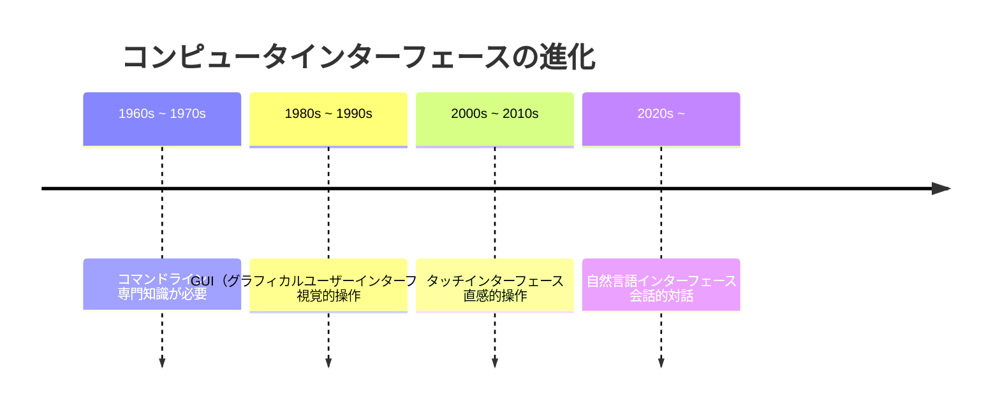
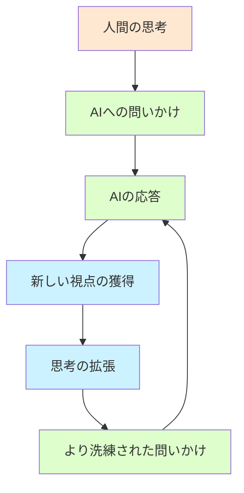

### 目的別プロンプト設計ガイド

**創造的タスク向け**
- □ 具体的な制約よりも方向性の提示を優先
- □ AIの提案から着想を得る余地を残す
- □ 複数のアイデアを生成してもらい選択肢を広げる
- □ 対話を通じて徐々に具体化していく

**分析・調査タスク向け**
- □ 分析の目的を明確に伝える
- □ 特定の観点がある場合は示す
- □ データや情報源の制約がある場合は伝える
- □ 必要な詳細度や形式を指定する

**技術的タスク向け**
- □ 必要なフォーマットや規格を明示
- □ エラー処理や例外ケースへの対応を指定
- □ 互換性や環境の制約を伝える
- □ 参考になる既存実装やドキュメントを示す

**教育・説明タスク向け**
- □ 対象読者のレベルを伝える
- □ 説明に含めるべき重要概念を示す
- □ 望ましい例示や比喩のスタイルを伝える
- □ 質問形式で段階的に理解を深める

## 第9章：AI時代のコミュニケーション革命

### 9.1 自然言語インターフェースの台頭

生成AIの進化により、コンピュータとの対話方法は根本的に変わりつつあります。コマンドラインやGUIに代わり、自然言語インターフェース（NLI）が新たな標準になりつつあります。



この変化は、技術と人間の関係性の根本的な変革を意味します。かつては人間が機械の「言語」を学ぶ必要がありましたが、今や機械が人間の言語を理解するようになりました。

> **コラム：「祖母とAIアシスタント」**
> 
> 技術に疎い80代の祖母が、音声AIアシスタントを驚くほど自然に使いこなしている様子を見て衝撃を受けました。パソコンのマウス操作すら難しかった祖母が、「今日の天気は？」「明日の予定を教えて」と話しかけ、情報を得ています。彼女が言うには「これまでの機械は私に合わせてくれなかったけど、これは私の言うことを聞いてくれる」とのこと。祖母にとっては複雑なUIや操作方法を覚える必要がなく、生まれてからずっと使ってきた「会話」というインターフェースで技術にアクセスできることが革命的だったのです。自然言語インターフェースの台頭は、技術の民主化と言えるかもしれません。これまで技術的障壁によってデジタル世界から疎外されていた人々が、言葉という最も基本的なツールを通じて参加できるようになるのですから。

### 9.2 プロンプトからの脱却：対話型インターフェースの未来

「プロンプト」という概念自体が過渡期のものかもしれません。将来的には、より自然な対話体験へと進化していく可能性があります。

**現在のプロンプトベースモデル：**
- ユーザーが質問や指示を入力
- AIが応答を生成
- 基本的に一方向のコミュニケーション

**将来の対話型インターフェース：**
- AIが積極的に質問や提案をする
- ユーザーの意図や文脈を継続的に学習
- 協働的な問題解決やクリエイティブプロセス

> **コラム：「AIとの共同執筆体験」**
> 
> 小説を書く趣味がある私は、AIとの共同創作を試みました。最初は「ファンタジー小説を書いて」と指示していましたが、ある時「一緒に物語を作らないか」と投げかけてみたところ、驚くほど異なる体験が生まれました。AIは単に私の指示に従うのではなく、「主人公のバックストーリーはどうしますか？」「この場面では、どんな感情を描きたいですか？」と問いかけてきたのです。まるで熟練した編集者と対話しているような感覚でした。執筆プロセスは単なる「指示と実行」ではなく、アイデアの交換と発展の場になりました。完成した作品は私一人では思いつかなかったような展開や描写に溢れ、本当の意味での「共同創作」になりました。未来のAIとの対話は、このような双方向のクリエイティブな共創になっていくのかもしれません。

### 9.3 AIとのコミュニケーションが変える仕事の未来

AIとの新しいコミュニケーション方法は、私たちの働き方にも大きな変革をもたらします。

**知識労働の変化：**
- 反復的なタスクからの解放
- 創造的思考や問題解決への集中
- AIとの協働による生産性向上

**新しい職種の出現：**
- AI協働スペシャリスト
- AIトレーナー/評価者
- AI出力キュレーター

**仕事のプロセスの変化：**
- アイデア生成と実行の高速化
- 専門知識へのアクセス民主化
- 個人の創造力と判断力の重要性増大

> **コラム：「プロンプトエンジニアという幻想」**
> 
> 2023年頃、「プロンプトエンジニア」という職種が話題になりました。「完璧なプロンプトを書ける人材」への需要が高まるという予測でした。しかし、AIモデルの進化により、この予測は的外れになりつつあります。あるテクノロジー企業の採用責任者は「我々が求めているのは複雑なプロンプトを書ける人ではなく、AIとの対話から価値を創出できる人材だ」と語ります。彼の会社では当初「プロンプトライブラリ」の構築に注力していましたが、モデルの進化によって複雑なプロンプトの多くが不要になったそうです。今や彼らが重視するのは「AIとの創造的コラボレーション能力」。特定のプロンプト技術ではなく、AIの可能性と限界を理解し、人間ならではの創造性や批判的思考と組み合わせて価値を生み出せる人材が求められているのです。「プロンプトエンジニア」よりも「AI創造的活用者」とでも呼ぶべき役割が、真に価値を持つようになるでしょう。

## 第10章：事例で見る現代的プロンプトの実践

### 10.1 ビジネス課題解決の事例

**＜ケーススタディ＞マーケティング戦略立案支援**

ある中小企業のマーケティング担当者は、新商品のプロモーション戦略を検討していました。以前は複雑なプロンプトテンプレートを使用していましたが、現代的アプローチに切り替えることで、より効率的かつ創造的な結果を得ることができました。

```
# 旧アプローチ（レガシープロンプト）
You are an experienced marketing strategist with expertise in product launches for small to medium businesses 
in the Japanese market. I want you to create a comprehensive marketing strategy for our new eco-friendly 
household cleaning product line targeting urban families with children. The strategy should include: 
market positioning, key messaging, primary and secondary target audience analysis, competitive landscape, 
recommended marketing channels with budget allocation percentages, social media strategy, content marketing plan, 
influencer collaboration strategy, and KPIs for measuring success. The tone should be environmentally conscious 
and family-friendly without being preachy. Include at least 3 creative campaign ideas and a 3-month 
launch timeline with specific milestones.

# 日本語訳
あなたは日本市場の中小企業向け製品発売におけるマーケティング戦略の専門家です。
都市部の子供のいる家族をターゲットにした、新しい環境に優しい家庭用洗浄製品ラインの
包括的なマーケティング戦略を作成してください。戦略には以下を含めてください：
市場ポジショニング、主要メッセージ、主要および二次的なターゲットオーディエンス分析、
競合状況、予算配分率を含む推奨マーケティングチャネル、ソーシャルメディア戦略、
コンテンツマーケティング計画、インフルエンサーコラボレーション戦略、成功を測定するためのKPI。
トーンは説教臭くなく、環境意識が高く、家族向けであるべきです。
少なくとも3つの創造的なキャンペーンアイデアと、特定のマイルストーンを含む3ヶ月の
発売タイムラインを含めてください。

# 新アプローチ（対話的プロンプト）
1. ユーザー：「環境に優しい洗剤の新商品のマーケティング戦略を考えたいんだけど」
2. AI：（基本的な質問と初期の方向性を提案）
3. ユーザー：「ターゲットは都市部の子育て世帯で、安全性と環境への配慮を訴求したい」
4. AI：（ターゲット層向けの具体的な戦略を提案）
5. ユーザー：「SNSを中心にしたいんだけど、どんなキャンペーンが効果的かな？」
6. AI：（SNSキャンペーンのアイデアを複数提案）
```

この対話的アプローチにより、担当者は自分のアイデアとAIの提案を組み合わせながら、より実践的で独自性のある戦略を策定することができました。また、会話の流れの中で思いもよらなかった視点（例：子どもたち自身を環境アンバサダーとして巻き込む戦略）が提案され、最終的な戦略に大きく貢献しました。

> **コラム：「対話から生まれる予想外の価値」**
> 
> あるスタートアップの創業者は、プロダクトマーケットフィットの分析をAIに依頼する際の経験を共有してくれました。当初は詳細な市場データと分析フレームワークを指定した長文プロンプトを用意していましたが、ある時「うちの商品、実はターゲット層に響いてないみたいなんだけど、どう思う？」と気軽に質問してみました。すると「そもそも御社の製品価値は技術面ではなく使用体験にあるのでは？」という意外な視点が提示され、マーケティングの方向性を根本から見直すきっかけになったそうです。「完璧なプロンプトを準備していたら、その枠組みの中でしか思考できなかったかもしれない」と彼は振り返ります。このケースは、対話的アプローチがしばしば構造化されたアプローチよりも深い洞察を生み出す可能性を示しています。

### 10.2 教育分野での事例

**＜ケーススタディ＞個別学習プランの作成**

中学校の教師は、生徒一人ひとりに合わせた学習計画の作成にAIを活用したいと考えていました。

```
# 旧アプローチ（レガシープロンプト）
You are an experienced educational consultant specialized in personalized learning for middle school students. 
Create a detailed 8-week study plan for a 14-year-old student who is struggling with algebraic concepts 
in mathematics but excels in history and language arts. The student has an attention span of approximately 
30 minutes for focused study and learns best through visual and hands-on approaches. Include specific learning 
objectives aligned with Japanese middle school curriculum standards, daily and weekly activities with time 
allocations, recommended resources including textbooks, apps, and websites, regular assessment methods to 
track progress, strategies for maintaining motivation, and suggestions for parental involvement. The plan 
should balance remedial work in mathematics with opportunities to further develop strengths in history and language arts.

# 日本語訳
あなたは中学生向けのパーソナライズド学習を専門とする経験豊富な教育コンサルタントです。
数学の代数的概念に苦戦しているが、歴史と言語芸術に秀でている14歳の生徒のための
詳細な8週間の学習計画を作成してください。この生徒は集中学習のための注意持続時間が
約30分で、視覚的かつ実践的なアプローチを通じて最もよく学びます。
日本の中学校カリキュラム基準に沿った具体的な学習目標、時間配分を含む日次および週次の活動、
教科書、アプリ、ウェブサイトなどの推奨リソース、進捗を追跡するための定期的な評価方法、
モチベーションを維持するための戦略、保護者の関与についての提案を含めてください。
計画は、数学における補習作業と、歴史および言語芸術における長所をさらに発展させる機会のバランスを取るべきです。

# 新アプローチ（対話的プロンプト）
1. 教師：「数学が苦手で歴史が得意な中学2年生向けの学習計画を作りたいんだけど」
2. AI：（基本的な学習計画の方向性を提案）
3. 教師：「この生徒、集中力が続くのは30分くらいで、視覚的な学習が効果的みたい」
4. AI：（生徒の特性に合わせた学習方法を提案）
5. 教師：「数学の中でも特に方程式の応用問題が苦手みたい。歴史の強みを活かせないかな」
6. AI：（歴史的なコンテキストを使った数学学習アプローチを提案）
```

この対話的なアプローチにより、教師は生徒の特性に合わせて計画を調整し、AIからのフィードバックを得ながら最適な学習プランを作成することができました。特に「歴史の文脈を数学学習に活用する」という視点は、教師が当初考えていなかった斬新なアプローチでした。

> **コラム：「生徒を知る先生とAIの共創」**
> 
> 教育工学を研究している知人は、「AIと教師の理想的な役割分担」について興味深い観察を共有してくれました。彼女の研究では、詳細な学習計画をAIに「発注」するように依頼する教師と、生徒の特性をAIと対話的に共有しながら計画を共創する教師の二つのアプローチを比較しました。結果として、後者のアプローチの方が生徒の特性に合わせたカスタマイズ性が高く、予想外の創造的な学習アイデアが生まれる傾向にあったそうです。彼女は「教師が持つ生徒理解という質的な知識と、AIが持つパターン認識能力や広範な教育手法の知識が、対話を通じて融合することで、どちらか単独では生まれない価値が創出される」と説明します。このような「人間とAIの共創」こそが、教育におけるAI活用の本質的な価値なのかもしれません。

### 10.3 クリエイティブ分野での事例

**＜ケーススタディ＞小説のプロット開発**

小説を執筆している作家は、物語のプロット開発にAIを活用したいと考えていました。

```
# 旧アプローチ（レガシープロンプト）
You are an experienced creative writing consultant with expertise in narrative structure and character development. 
I want you to help me develop a detailed plot outline for a mystery novel set in contemporary Kyoto. 
The protagonist should be a female detective in her 40s who specializes in cold cases. The novel should 
incorporate elements of traditional Japanese culture, particularly the tea ceremony, as central to the mystery. 
The plot should include a murder that occurred 20 years ago at a famous tea house, at least 3 suspicious 
characters with compelling motives, a series of clues hidden in tea ceremony artifacts, a red herring that 
leads the detective astray mid-investigation, and a surprising yet logical resolution that ties to the 
protagonist's personal history. The narrative should follow a three-act structure with clear inciting incident, 
rising action, climax, and resolution. Include suggestions for at least 2 subplots that complement the main 
mystery and develop the protagonist's character arc.

# 日本語訳
あなたはナラティブ構造とキャラクター開発の専門知識を持つ経験豊富なクリエイティブライティングコンサルタントです。
現代京都を舞台にしたミステリー小説の詳細なプロット概要を開発するのを手伝ってください。
主人公は未解決事件を専門とする40代の女性探偵であるべきです。小説は伝統的な日本文化の要素、
特に茶道をミステリーの中心として取り入れるべきです。プロットには、有名な茶室で20年前に発生した殺人事件、
説得力のある動機を持つ少なくとも3人の怪しい人物、茶道の工芸品に隠された一連の手がかり、
調査の途中で探偵を迷わせる偽の手がかり、そして主人公の個人的な歴史に結びつく驚くべきながらも
論理的な解決が含まれるべきです。物語は明確な発端事件、上昇アクション、クライマックス、解決を含む
三幕構造に従うべきです。主要なミステリーを補完し、主人公のキャラクターアークを発展させる
少なくとも2つのサブプロットの提案を含めてください。

# 新アプローチ（対話的プロンプト）
1. 作家：「京都を舞台にした茶道に関連するミステリー小説のプロットを考えたいんだけど」
2. AI：（基本的なプロットの方向性といくつかのアイデアを提案）
3. 作家：「主人公は40代の女性探偵で、未解決事件を追っているという設定はどうかな」
4. AI：（キャラクター設定と物語の可能性を発展させて提案）
5. 作家：「茶道の道具に隠された手がかりというアイデアが気に入ったんだけど、もう少し掘り下げられない？」
6. AI：（茶道道具と手がかりに関する詳細なアイデアを提案）
```

この対話的なアプローチにより、作家はAIと協力しながら物語の要素を徐々に発展させることができました。特に重要だったのは、作家が気に入ったアイデア（茶道道具に隠された手がかり）に焦点を当て、そこから物語を膨らませていけたことです。また、会話の中でAIが提案した「現代の犯罪と歴史的な事件のつながり」というアイデアが、作家の創作意欲を大いに刺激したそうです。

> **コラム：「AIは代筆者ではなく共同創作者」**
> 
> プロの小説家である友人は、AIとの創作プロセスについて面白い視点を持っています。「初めてAIを使った時は『小説を書いて』と頼んでいた。つまり代筆者のように扱っていた」と彼は言います。しかし、そのアプローチでは平凡な作品しか生まれませんでした。転機となったのは、AIを「共同創作者」として扱い始めたこと。「『このキャラクターがこんな状況でどう反応すると思う？』『この展開には無理がある？』といった問いかけをするようになった」と彼は説明します。こうした対話の中で、彼が思いつかなかったようなキャラクターの動機や物語の転換点のアイデアが生まれたそうです。彼は「AIは私の代わりに書くものではなく、私のアイデアを反射し、拡張し、挑戦してくれる創造的パートナー」と表現します。この視点は、AIをツールとしてではなく、共同創作者として扱うことの可能性を示しています。

## 第11章：AIとの対話を通じた学びと創造

### 11.1 AIとの対話を通じた思考の拡張

AIとの対話は、単なる情報取得や作業効率化にとどまらず、私たち自身の思考プロセスを拡張する可能性を秘めています。

**思考の拡張としてのAI対話：**
- 異なる視点からの問題再定義
- 思考の盲点の発見
- 創造的連想の促進
- 自己の思考パターンの認識



> **コラム：「思考を映し出す鏡としてのAI」**
> 
> 認知科学者の友人は、AIを「思考を映し出す鏡」として使う実験を行っています。彼女は研究プロジェクトについてAIと対話した後、その会話記録を分析して自分の思考パターンを観察するのです。「驚いたのは、AIとの対話で自分の思考の偏りや前提に気づくことが多いこと」と彼女は言います。例えば、ある社会問題について議論した際、AIの応答から自分が無意識に特定の側面だけを重視していたことに気づいたそうです。彼女によれば「AIは私の質問や反応の仕方を通して、私自身の思考の癖を映し出してくれる」とのこと。これはソクラテスの対話法を思わせるものがあります。AIとの対話は、単に情報を得るだけでなく、自己の思考を客観的に観察し、拡張する機会になり得るのです。

### 11.2 創造的コラボレーションの新しい形

AIとの対話は、創造的コラボレーションの新しい形を生み出しています。従来の人間同士のコラボレーションとは異なる特性を持つこの新しい共創は、私たちの創造プロセスを変革する可能性があります。

**AIとの創造的コラボレーションの特徴：**
- 即時的なフィードバックとアイデア生成
- バイアスや社会的制約からの一時的解放
- 多様な視点や文体の探索
- 人間の直感とAIのパターン認識の融合

> **コラム：「作曲家とAIの共演」**
> 
> 現代音楽の作曲家である友人は、最近の作品創作でAIとの対話を活用していると話してくれました。彼は「最初は『この曲調でメロディを作って』といった指示的な使い方をしていた」と言います。しかし、より対話的なアプローチに変えたことで創作プロセスが大きく変わったそうです。「今はアイデアの断片をAIと共有し、『このフレーズをどう発展させる？』『この転調は意外性があると思う？』といった問いかけをする」と彼は説明します。特に興味深いのは、AIが提案する予想外の方向性が、彼自身の創造的思考を刺激すること。「AIは時に音楽理論の枠を超えた提案をしてくれる。それは技術的には『間違い』かもしれないが、創造的な観点では刺激的なアイデアになることがある」と彼は語ります。彼の最新アルバムには、このような「共創」から生まれた楽曲が含まれており、「単独では思いつかなかったアプローチ」だと評価されているそうです。

### 11.3 AIとの対話を通じた自己理解と成長

AIとの対話は、自己理解と成長の新たな機会も提供します。自分の考えをAIに説明すること自体が、自己の思考を整理し深める効果があります。

**AIとの対話を通じた自己成長：**
- 自己の考えの言語化と明確化
- 自分の知識やスキルのギャップの認識
- 多様な視点への開放性の向上
- 批判的思考力と情報評価能力の向上

> **コラム：「AIとの対話日記」**
> 
> 心理学を学ぶ大学院生の友人は、「AIとの対話日記」という興味深い習慣を続けています。毎日15分、その日考えたことや悩みをAIに話しかけ、AIからの質問や観察に応答するという実践です。「最初は単なる記録のつもりだったけど、AIが投げかける『なぜそう感じたのだろう？』『それは過去のどんな経験と関連しているかも？』といった問いが、自己洞察を深めるきっかけになっている」と彼女は言います。特に印象的だったのは、キャリアの悩みについて対話した際、AIが彼女の言葉の選び方や繰り返すパターンを指摘してくれたこと。「自分では気づかなかった思考の癖に気づくことができた」と振り返ります。彼女によれば、AIとの対話は「判断されないセーフスペース」として機能し、自由に思考を広げられる場になっている