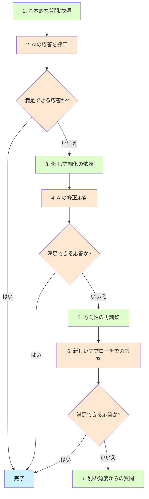

とが「自分では気づかなかった思考の癖に気づくことができた」と振り返ります。彼女によれば、AIとの対話は「判断されないセーフスペース」として機能し、自由に思考を広げられる場になっているそうです。このような実践は、心理的内省と自己認識を深める新しい方法として注目される可能性があります。

## 第12章：現代的プロンプトの実践的テクニック

### 12.1 シンプルから始める具体的な方法

シンプルなプロンプトから始めるアプローチは、理論的には理解できていても実践するのは難しいと感じる人も多いでしょう。ここでは、具体的なテクニックを紹介します。

**シンプルな開始プロンプトのパターン集：**

```
# 情報収集型
「[トピック]について教えて」
「[概念]の基本を説明して」
「[トピック]の最新動向は？」

# 創作支援型
「[ジャンル]の[作品タイプ]のアイデアが欲しい」
「[テーマ]に関する[文章タイプ]を書きたい」
「[対象]向けの[コンテンツタイプ]を作りたい」

# 問題解決型
「[問題]の解決策を考えたい」
「[課題]にどう対応すればいい？」
「[目標]を達成するための方法は？」

# 分析型
「[データ/状況]を分析して」
「[事象]の原因として考えられるのは？」
「[製品/アイデア]の強みと弱みは？」
```

これらのシンプルなプロンプトから始め、AIの応答を見ながら必要な情報や制約を追加していくのが効果的です。

> **コラム：「最小限の指示で最大限の効果」**
> 
> UXデザイナーの友人は「最小実行可能プロンプト（MVP：Minimum Viable Prompt）」という考え方を取り入れています。これはスタートアップの「最小実行可能製品」の概念をプロンプトに応用したものです。「最初から完璧を目指すのではなく、対話を開始するための最小限の明確な指示から始める」という考え方です。彼女によれば「AIとの対話の第一歩では、相手の応答を見るのに十分なだけの情報を伝えればよい」とのこと。例えば新しいアプリのデザインについて考える際、「モバイルアプリのUIデザインのアイデアを出して」という単純な指示から始め、AIの応答を見てから「もっとミニマリストなデザインで」「高齢者にも使いやすいものを重視して」といった具体的な方向性を伝えていくそうです。この反復的なアプローチは、一度に完璧なプロンプトを作成しようとするよりも、結果的に時間を節約し、より良い成果につながると彼女は言います。

### 12.2 対話の流れを設計する

効果的なAIとの対話は、単発のやりとりではなく、目的に向かって段階的に発展していく一連の流れとして捉えることが重要です。

**対話フロー設計の基本パターン：**



**対話フローの実践例（マーケティングプラン作成）：**

```
1. ユーザー：「新しい健康スムージーのマーケティングプランを考えたい」
2. AI：（基本的なマーケティングプランの概要を提案）
3. ユーザー：「ターゲットは20-30代の健康意識の高い女性にしたい。SNSを中心に考えてもらえる？」
4. AI：（ターゲットとSNS戦略に焦点を当てた修正プランを提案）
5. ユーザー：「インフルエンサーマーケティングの部分をもっと詳しく知りたい」
6. AI：（インフルエンサーマーケティング戦略の詳細を提案）
7. ユーザー：「良いね。予算が限られている場合、どこを優先すべき？」
8. AI：（限られた予算での優先順位を提案）
```

この対話フローでは、基本的なアイデアから始め、徐々に具体的な要素に焦点を当て、最終的には実用的な制約（予算）を考慮した計画へと発展させています。

> **コラム：「会話の舵取り上手になる」**
> 
> 私の同僚は、AIとの対話を「即興の共同創作」に例えています。彼によれば「プロンプトエンジニアリングというと、まるで機械に正確な命令を与えるような印象があるが、実際はジャズセッションのリードプレイヤーのような役割」だそうです。彼のアプローチは「まずは大まかな方向性を示し、AIの反応を見ながら、時に引き出し、時にリズムを変え、時に新しいモチーフを導入する」というもの。特に興味深いのは「予想外の良いアイデアが出てきたら、そこに焦点を当てて発展させる柔軟性を持つこと」の重要性を強調している点です。例えば、企画書作成の際に「単なる付録として提案されたアイデアが、実は全体のコンセプトを変えるほど魅力的だと気づき、方向性を転換した」経験を共有してくれました。固定的なテンプレートに従うのではなく、対話の中で生まれる可能性に敏感になることが、AIとの創造的な共同作業の鍵なのかもしれません。

### 12.3 フィードバックを効果的に伝える

AIとの対話を改善するためには、効果的なフィードバックの伝え方が重要です。具体的かつ建設的なフィードバックを提供することで、より良い結果に導くことができます。

**効果的なフィードバックパターン：**

```
# 具体的な改善点の指摘
「[具体的な部分]をもう少し[求める方向]にしてほしい」
「[内容の一部]が[理由]で適切ではないので、[代替案]を検討して」

# 良い点の強化
「[具体的な部分]が良かったので、それをさらに発展させて」
「[アプローチ]が効果的だと思うので、それを中心に展開して」

# 方向性の修正
「もう少し[新しい方向性]に焦点を当ててみよう」
「[別の視点]からのアプローチも考えてみて」

# 具体化の依頼
「[概念/アイデア]についてもっと具体的な例を示して」
「[提案]を実行するための具体的なステップを教えて」
```

> **コラム：「AIへのフィードバック、人へのフィードバック」**
> 
> 人材開発コンサルタントの友人は、「AIへのフィードバックの仕方は、人へのフィードバックと意外と似ている」と指摘します。効果的なフィードバックの原則——具体的であること、建設的であること、行動につながること——はどちらにも適用されるそうです。彼女が強調するのは「批判だけでなく、何が良かったかも伝えること」の重要性。「『これは役に立たない』というだけでは、相手（人間でもAIでも）は次に何をすべきかわからない。『この部分は良かったけど、ここをこう変えるともっと良くなる』という形が効果的」とアドバイスします。また興味深いのは、「AIへのフィードバックの練習が、人間関係のコミュニケーション能力向上にも役立つ」という観察。「AIは感情を傷つける心配なく、率直なフィードバックが練習できる場」として、コミュニケーションスキルのトレーニングにも役立つと彼女は考えています。

### 12.4 特定のタスクに特化したテクニック

特定のタスクや目的に応じて、効果的なプロンプトテクニックは異なります。ここでは、一般的なタスクごとのテクニックを紹介します。

**文章作成タスクのテクニック：**

```
# 段階的なブレインストーミング
1. ユーザー：「環境問題に関するブログ記事を書きたい」
2. AI：（いくつかの切り口や方向性を提案）
3. ユーザー：「プラスチック汚染の部分が気になるな。個人でできる対策という視点で掘り下げてみて」
4. AI：（プラスチック汚染対策に焦点を当てたアイデアを提案）
5. ユーザー：「良いね。これを5つのポイントにまとめた記事の構成を考えてくれる？」

# 参考例の提示とカスタマイズ
1. ユーザー：「説得力のあるセールスレターの書き方を知りたい」
2. AI：（セールスレターの基本構造と原則を説明）
3. ユーザー：「具体的な例があるとわかりやすいかも」
4. AI：（サンプルのセールスレターを提示）
5. ユーザー：「このような構成で、ECOフレンドリーな掃除用品を売り込むレターを作成して」
```

**問題解決タスクのテクニック：**

```
# 複数視点からの分析
1. ユーザー：「チームのモチベーション低下の問題を解決したい」
2. AI：（一般的な原因と解決策を提案）
3. ユーザー：「管理者、チームメンバー、人事部それぞれの視点からこの問題を分析してみて」
4. AI：（複数の視点からの分析を提示）
5. ユーザー：「リモートワーク環境での具体的な改善策を3つ提案して」

# 制約条件下での解決策
1. ユーザー：「小規模チームでのプロジェクト管理の効率化方法は？」
2. AI：（一般的なプロジェクト管理改善策を提案）
3. ユーザー：「予算が限られていて、新しいツールの導入は難しい状況なんだ」
4. AI：（低予算でも実施可能な改善策を提案）
5. ユーザー：「具体的に明日から実践できるアクションプランを示して」
```

> **コラム：「制約がクリエイティビティを生む」**
> 
> プロダクトデザイナーの友人は、AIとのブレインストーミングで「意図的制約」を活用する興味深い手法を共有してくれました。彼は最初は「新しい製品アイデアを考えて」といった幅広い依頼をしていましたが、返ってくるアイデアは一般的で特に革新的ではなかったそうです。転機となったのは「制約理論」を取り入れたとき。例えば「電源のない場所でも使える調理器具のアイデア」「3Dプリンターだけで製造できる家具」など、特定の制約を設けた質問をすることで、より創造的なアイデアが生まれるようになりました。「制約があることで、AIの思考が新しい方向に向かう。これは人間の創造性とも共通している」と彼は言います。この手法は「逆ブレインストーミング」とも呼ばれ、わざと難しい条件を設定することで、従来の思考の枠を超えたアイデアを生み出す狙いがあるそうです。

## 第13章：AIとの対話の倫理と責任

### 13.1 AIとの対話における責任ある姿勢

AIとの対話が日常的になる中で、私たちはどのような倫理的姿勢でこの技術と向き合うべきでしょうか。

**AIとの対話における責任ある姿勢：**
- 出力内容の批判的評価
- AIの限界と偏りの認識
- 最終的な判断と責任の所在の明確化
- 結果の検証と修正
- 透明性の確保

> **コラム：「AIは助手であって、決断者ではない」**
> 
> 医療分野でAIを研究している友人は、「AIとの関係性における最大の危険は、人間が自分の判断力を手放してしまうこと」だと警鐘を鳴らします。彼の研究室では医療診断支援にAIを活用していますが、「最初は医師がAIの提案を過度に信頼し、自分の臨床判断より優先する傾向があった」と言います。これは「オートメーションバイアス」と呼ばれる現象で、人間が自動化システムを過信してしまう心理です。研修を通じて「AIは情報提供者であり、決断者ではない」という意識を徹底した結果、医師とAIの協働がより効果的になったそうです。AIとの健全な関係は「主従」でも「盲信」でもなく、それぞれの強みを活かした「協働」であるべきだと彼は強調します。プロンプトの進化も「命令の精緻化」から「対話を通じた協働」へと向かっているのは、この原則に沿ったものと言えるでしょう。

### 13.2 プロンプトとコンテンツの多様性と包括性

AIとの対話において、多様性と包括性を意識することも重要です。私たちの問いかけ方や期待する回答の枠組みによって、AIの出力は大きく変わります。

**多様性と包括性を高めるためのアプローチ：**
- 多様な視点の考慮を明示的に依頼する
- 自分のバイアスや前提を認識する
- 複数の文化的コンテキストでの検討を促す
- ステレオタイプの再生産に注意する
- 包括的な言語表現を意識する

```
# 多様性を考慮したプロンプト例
「この製品のユーザー体験を考える際に、異なる年齢層、文化的背景、能力を持つ人々の視点を考慮して」

「この社会問題について、異なる立場からの視点を示して」

「このキャラクター設定で、ステレオタイプを避けた多様な表現方法を提案して」
```

> **コラム：「無意識のバイアスとの対話」**
> 
> 多様性コンサルタントとして働く友人は、「AIとの対話は、私たち自身の無意識のバイアスを映し出す鏡になる」と言います。彼女はクライアント企業の採用資料をAIで分析する際、最初は「理想的な人材像」について尋ねていましたが、返ってくる回答には無意識のうちに特定の性別や文化的背景を想定したバイアスが含まれていることに気づきました。そこで「多様なバックグラウンドの人材にアピールする資料にするには」と質問の枠組みを変えたところ、より包括的な視点が得られたそうです。「私たちがAIに投げかける問いの立て方自体に、私たち自身の前提やバイアスが反映される」と彼女は指摘します。AIとの対話を通じて自分自身のバイアスに気づき、より意識的で包括的な問いかけができるようになることが、AIを責任を持って活用するための重要なステップなのかもしれません。

### 13.3 AIとの健全な関係構築

テクノロジーの進化とともに、私たちとAIの関係性も変化しています。依存や過信ではなく、健全な協働関係を構築することが重要です。

**健全なAI活用のための原則：**
- AIを道具ではなく、協働パートナーとして捉える
- 批判的思考力と判断力を保持する
- AIの得意分野と苦手分野を理解する
- 人間の創造性とAIの能力の相補的活用
- 継続的な学習と適応の姿勢

> **コラム：「テクノロジーとの関係は選択できる」**
> 
> テクノロジー哲学を研究している教授は、「AIとの関係性は私たちが意識的に選択できるものだ」と強調します。彼によれば、テクノロジーとの関係には大きく分けて3つのモデルがあるそうです。「支配モデル」（人間がテクノロジーを完全にコントロールする）、「従属モデル」（人間がテクノロジーに依存または制御される）、そして「共生モデル」（人間とテクノロジーが相互に影響し合いながら共に進化する）です。AIとの関係においても、私たちはこれらのモデルから選択することができます。「レガシープロンプトの発想は『支配モデル』に近い。AIに正確に命令し、従わせようとする。一方、現代的なプロンプトのアプローチは『共生モデル』に近づいている」と彼は分析します。「共生モデル」では、人間もAIも互いに影響し合い、学び合う関係になります。このような関係性が、長期的には最も創造的で持続可能なAIとの付き合い方かもしれません。

## 結論：変化し続けるAIとの対話の未来

「レガシープロンプト」からの脱却と、より自然で対話的なアプローチへの移行は、AIの進化とともに起きている必然的な変化です。この変化は単なるテクニックの問題ではなく、人間とAIの関係性の根本的な転換を示しています。

命令と実行の関係から、協働と共創の関係へ。固定的なテンプレートから、流動的な対話へ。こうした変化は、AIの可能性をより豊かに引き出すとともに、私たち自身の思考プロセスや創造性を拡張する新たな可能性を開いています。

プロンプトの設計は、AIの進化とともに変化し続けるでしょう。そして最終的には「プロンプト」という概念自体が溶解し、より自然な対話や共創のプロセスへと発展していくかもしれません。

重要なのは、固定的な「正しいプロンプト」を追求するのではなく、常に新しい可能性を探り、実験し、学び続ける姿勢です。AIとの対話を通じて、私たちが自身の思考の限界を超え、新たな創造性と知性を発揮できるようになる。そんな未来に向けて、私たちのコミュニケーション方法も進化を続けていくことでしょう。

> **コラム：「進化するAIとの対話、変わらない人間の本質」**
> 
> 私の祖父は90歳を超える高齢ですが、最近AIアシスタントを使い始めました。当初は孫である私が「こう話しかけるといいよ」と複雑な指示を教えていましたが、数週間後に訪ねてみると、祖父は自分なりの方法でAIと対話していました。「難しいことは考えずに、普通に話しかけているよ」と祖父。実際、彼の単純明快な質問や依頼に対して、AIは十分に適切な応答をしていました。この経験から私は重要なことに気づきました。テクノロジーがどれだけ進化しようとも、人間のコミュニケーションの本質——明確に意図を伝え、相手の反応を見て調整する——は変わらないということです。むしろAIの進化は、複雑な指示や特殊な言い回しという「障壁」を取り除き、より自然な対話を可能にしています。祖父とAIの対話を見ていると、テクノロジーの最終的な姿は、その存在を意識させないほど自然に人間の意図を理解するものなのかもしれない、と思わずにいられません。プロンプトの進化も、この普遍的な方向性——複雑さから単純さへ、特殊性から自然さへ——に向かっているのではないでしょうか。

## 付録：プロンプトパターン集

### 基本プロンプトパターン

```
# 情報収集型
「[トピック]について教えて」
「[概念]の基本を説明して」
「[トピック]の最新動向は？」

# 創作支援型
「[ジャンル]の[作品タイプ]のアイデアが欲しい」
「[テーマ]に関する[文章タイプ]を書きたい」
「[対象]向けの[コンテンツタイプ]を作りたい」

# 問題解決型
「[問題]の解決策を考えたい」
「[課題]にどう対応すればいい？」
「[目標]を達成するための方法は？」

# 分析型
「[データ/状況]を分析して」
「[事象]の原因として考えられるのは？」
「[製品/アイデア]の強みと弱みは？」
```

### タスク別プロンプトパターン

**ビジネス・企画開発**

```
# 市場分析
「[製品/サービス]の市場動向を分析して」
「[業界]の競合状況を教えて」

# アイデア創出
「[目的]のための革新的なアイデアを考えて」
「[製品]の新しい活用方法を提案して」

# 戦略立案
「[目標]を達成するための戦略を考えて」
「[課題]に対処するためのアクションプランは？」
```

**コンテンツ制作**

```
# 構成立案
「[テーマ]についての[文章タイプ]の構成を考えて」
「[対象読者]向けの[コンテンツ]の章立てを提案して」

# 編集・改善
「この文章をもっと[目的]に適した表現に改善して」
「この内容をより[読者層]に伝わるように書き直して」

# クリエイティブ発想
「[キーワード]から連想される物語のアイデアは？」
「[テーマ]を表現する新しいメタファーを考えて」
```

**教育・学習**

```
# 概念説明
「[概念]を初心者にもわかりやすく説明して」
「[専門用語]を日常的な例えを使って解説して」

# 学習計画
「[スキル]を習得するための学習計画を立てて」
「[試験/目標]のための効率的な勉強方法は？」

# 知識の整理
「[トピック]について知っておくべき重要ポイントをまとめて」
「[分野]の基本原則を体系的に説明して」
```

**プロジェクト管理**

```
# タスク整理
「[プロジェクト]のタスクを優先度別に整理して」
「[目標]達成のためのマイルストーンを設定して」

# リスク分析
「[計画]の潜在的なリスクを分析して」
「[プロジェクト]で考えられる障害と対策は？」

# リソース配分
「[タスク]に必要なリソースを最適化するには？」
「限られた[リソース]で[目標]を達成する方法は？」
```

### フィードバックとリファインメントのパターン

```
# 具体化の依頼
「もう少し具体的な例を示してもらえる？」
「[提案]を実行するための具体的なステップは？」

# 方向性の調整
「もう少し[新しい方向性]に焦点を当ててみよう」
「[特定の要素]についてより詳しく掘り下げて」

# 改善の依頼
「[部分]をもっと[目的]に合うように改善して」
「[理由]があるので[要素]を変更してもらえる？」

# 選択肢の精査
「これらの案の中で、[条件]に最も適しているのは？」
「[提案]の長所と短所を分析してもらえる？」
```

これらのパターンは、目的や状況に応じてカスタマイズして使用することができます。大切なのは、固定的なテンプレートとしてではなく、対話の出発点として捉え、AIの応答に基づいて柔軟に調整していくことです。
