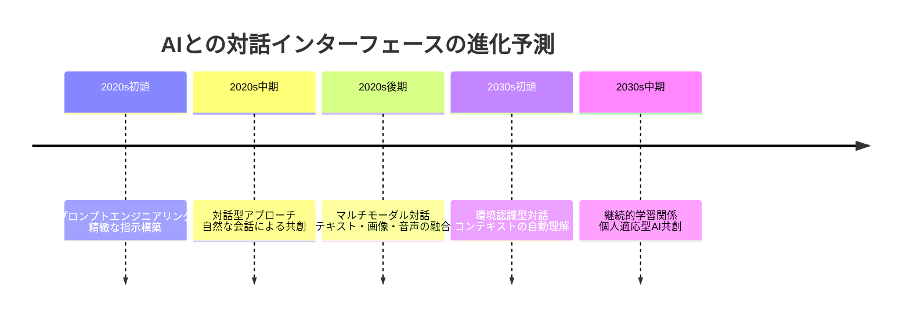
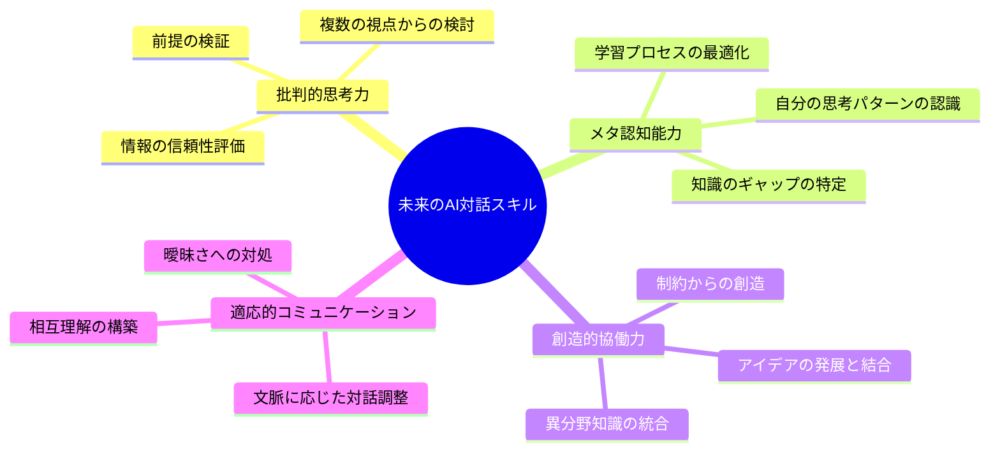
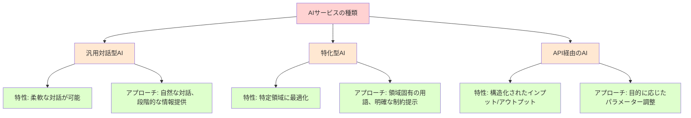

## 第14章：未来への展望 - 変容するAIとの関係性

### 14.1 プロンプトの進化とAIとの対話の未来

私たちがAIとやり取りする方法は、テクノロジーの進化とともに急速に変化しています。現在のプロンプトベースの対話から、将来的にはどのような変化が予想されるでしょうか。



目の前のこの進化がもたらす重要な変化の一つは、「プロンプト」という概念自体の溶解かもしれません。未来のAIとのインタラクションでは、現在のような明示的な「問いかけと応答」という枠組みを超え、より流動的で継続的な共同作業の形になる可能性があります。

> **コラム：「通訳からパートナーへ」**
> 
> AIと人間の関係性の進化を、ある哲学者は「通訳からパートナーへの変化」と表現しています。初期のAIとのやり取りは、まるで異なる言語を話す相手とのコミュニケーションのようでした。プロンプトエンジニアリングは、この「外国語」を正確に翻訳するための文法のような役割を果たしていました。しかし、AIの理解力と文脈把握能力が向上するにつれ、この関係は変化しています。今や私たちは通訳を介さずに直接対話できるようになり、さらに将来的には、言葉を交わす以上の共同作業が可能になるでしょう。例えるなら、外国人観光客のガイドから、共同研究者や創作パートナーへと関係性が発展しているのです。この変化は、テクノロジーと人間の関係性の根本的な再定義を示唆しています。

### 14.2 AIによる自己進化と対話の自己改善

現代のAIモデルはすでに、対話を通じて自らの応答を改善する能力を持っています。将来的には、AIが自己のパフォーマンスを評価し、ユーザーとの対話を通じて学習・適応していく能力がさらに向上するでしょう。

この自己改善の能力は、プロンプト設計の重要性をさらに変化させます。ユーザーが完璧なプロンプトを作成する必要性は減少し、代わりに「AIとの協働的な対話スキル」が重要になってきます。

**今後予測される変化：**
- ユーザーの好みや対話スタイルを学習するパーソナライズドAI
- 対話の履歴や文脈を深く理解し活用する長期記憶能力
- ユーザーの意図を推測し、曖昧な指示を明確化する能力
- 複数のモダリティ（テキスト、画像、音声など）の統合的理解

> **コラム：「デジタル庭師としてのユーザー」**
> 
> あるAI研究者は、未来のAIとのやり取りを「庭園と庭師の関係」にたとえています。彼によれば、レガシープロンプトの時代は「一本の植物を育てるために詳細な手順書を書く」ようなものでした。現代の対話型アプローチは「庭に水をやり、時に枝を剪定しながら、植物の自然な成長を促す」ような関係です。そして将来的には「庭全体のエコシステムを理解し、最小限の介入で全体の調和を導く」ようなアプローチになるだろうと予測しています。「完璧な指示」よりも「効果的な共育関係」が重要になるというこの視点は、AIとの関係性をより有機的なものとして捉え直す興味深い観点です。

### 14.3 実践的な未来への備え方

AIとの対話方法が進化し続ける中で、私たち自身もそれに適応し、新しいスキルや思考方法を身につける必要があります。将来的に価値を持つスキルとは何でしょうか。

**未来のAI対話に備えるためのスキル：**



> **コラム：「AIと共に成長するためのマインドセット」**
> 
> 教育学者の友人は、AIとの関係において最も重要なのは「スキル」よりも「マインドセット」だと主張します。彼女が提唱する「AIとの共生的成長マインドセット」は以下の要素から成り立っています：「好奇心」（新しい可能性への開放性）、「謙虚さ」（自分の限界の認識）、「主体性」（テクノロジーへの能動的関与）、「批判的受容」（盲信せず、価値あるものを取り入れる姿勢）、そして「継続的学習への意欲」です。彼女によれば、これらの態度はAIのような急速に変化するテクノロジーとの関係において、特定のテクニックよりも長期的に価値があるとのこと。「レガシープロンプトからの脱却」も、究極的には技術的な変化以上に、このようなマインドセットの変革を意味するのかもしれません。

## 第15章：総合的実践ガイド

### 15.1 レガシープロンプトから現代的対話への移行ステップ

これまでの章で学んだ内容を実践に移すための具体的なステップを整理します。レガシープロンプトのアプローチから現代的な対話アプローチへの移行は、一朝一夕には行かないかもしれません。以下に段階的な移行プロセスを提案します。

**ステップ1: 現在のプロンプトパターンを認識する**
- 自分が頻繁に使うプロンプトを収集・分析する
- 冗長な部分、過度な指示を特定する
- どの要素が本当に必要かを評価する

**ステップ2: シンプル化の実験**
- 使用頻度の高いプロンプトの簡略版を作成する
- 両方を試し、結果を比較する
- うまくいかなかった場合の原因を分析する

**ステップ3: 対話的アプローチへの移行**
- 一度に全ての情報を伝えるのではなく、段階的に伝える習慣をつける
- AIの応答を見てから次の指示を考える
- フィードバックと修正のサイクルを意識する

**ステップ4: 目的に応じたアプローチの使い分け**
- 創造的タスクには自由度の高いプロンプトを使用
- 精度が重要なタスクには必要な制約を明示する
- タスクの性質に応じてレガシーと現代的アプローチを使い分ける

**ステップ5: 継続的な学習と改善**
- 新しいテクニックや事例を学び続ける
- 成功体験と失敗体験を記録し分析する
- AIとのコミュニケーションスタイルを進化させ続ける

> **コラム：「古い習慣を手放す勇気」**
> 
> 企業のDX推進責任者をしている友人は、組織全体のAI活用方法を変革する過程で興味深い心理的抵抗に直面したと話します。「長年使ってきた複雑なプロンプトテンプレートを捨てることに、多くの人が不安を感じていた」と彼は言います。これは単なる技術的な問題ではなく、心理的な「安全毛布」を手放すことへの抵抗だったそうです。彼のチームは移行を成功させるために「プロンプトA/Bテスト」という手法を導入しました。従来の複雑なプロンプトと、シンプル化したプロンプトの両方を試し、結果を客観的に比較するというアプローチです。「数値で見える成果が、心理的な抵抗を乗り越える助けになった」と彼は振り返ります。技術的な変革の裏には、常に心理的・文化的な変革が伴うものなのです。

### 15.2 様々なAIサービスへの適用

現代的プロンプトの原則は、様々なAIサービスに適用可能ですが、サービスごとの特性を理解することも重要です。

**主要なAIサービスの特性と最適なアプローチ：**



**サービス別の具体的なヒント：**

1. **ChatGPT、Claude等の汎用対話型AI**
   - 自然な対話を重視
   - 文脈の継続性を活用
   - 中間結果のフィードバックと方向性の調整

2. **特化型AI（コード生成、画像生成等）**
   - 領域固有の用語や表現を活用
   - 出力形式の明示が重要な場合も
   - 段階的な改良のサイクルを意識

3. **API経由のAI**
   - 目的に応じたパラメーター調整
   - バッチ処理と対話処理の使い分け
   - システム統合を見据えた設計

> **コラム：「AIサービスの個性を理解する」**
> 
> IT企業でAI導入コンサルティングをしている知人は、「AIサービスも人間と同じで、それぞれ異なる個性を持っている」と表現します。彼の経験では、同じプロンプトでも異なるAIサービスで試すと、驚くほど異なる結果が得られることがあるそうです。「最初は『正しいプロンプト』を探そうとしていたが、実際は『このAIサービスとの効果的な対話方法』を見つける必要があった」と彼は振り返ります。彼がクライアントにアドバイスするのは、「複数のAIサービスを試してみて、自分のコミュニケーションスタイルや目的に最も合うものを選ぶこと」。そして選んだサービスの「個性」に合わせて対話スタイルを調整することが重要だとのこと。これは人間関係においても同じですね。一人ひとり異なる個性を持つ人間と、画一的ではなく相手に合わせたコミュニケーションを心がけるように、AIサービスについても同様の配慮が効果的なのかもしれません。

### 15.3 学習と実践のための資源とコミュニティ

AIとの効果的な対話スキルを継続的に向上させるためには、様々な資源やコミュニティの活用が有効です。

**学習リソースの種類：**
- オンラインコース・チュートリアル
- 実践的ワークショップ
- 専門書・技術ブログ
- ケーススタディコレクション
- オープンソースプロンプトライブラリ

**コミュニティ参加のメリット：**
- 最新の手法や事例の共有
- 問題解決のための集合知の活用
- フィードバックと改善の機会
- 多様な応用分野からの学び
- モチベーションの維持と向上

> **コラム：「学び合いのコミュニティの力」**
> 
> AIの活用法を学ぶオンラインコミュニティを運営している知人は、「テクノロジーの学習において、コミュニティの力は教材以上に重要」だと強調します。彼女のコミュニティでは、初心者から専門家まで様々なレベルのメンバーが、日々の発見や疑問を共有しています。「特に印象的なのは、異なる分野の人々が交流することで生まれる創発的なアイデア」だと彼女は言います。例えば、マーケティング担当者が使っていたAIとの対話テクニックが、教育者のコンテンツ作成に応用されたり、エンジニアのデバッグアプローチが小説家の創作プロセスに影響を与えたりするケースがあるそうです。「テクノロジーの進化が速い時代には、公式な教材よりも実践的な知恵の交換の方が価値がある」という彼女の言葉は、AI時代の学習のあり方を示唆しています。

## 最終章：AIとの対話の芸術と科学

### プロンプトからの自由：創造性と効率性の新たな地平

本書のタイトル「それってレガシープロンプト」は、単に古い技術手法を批判するものではありません。それは私たちとAIの関係性における本質的な変化を象徴しています。

レガシープロンプトからの脱却は、単なる効率化やテクニックの進化以上の意味を持ちます。それは、AIをより創造的なパートナーとして受け入れ、人間とAIの能力を最大限に引き出す新しい協働関係への移行です。

私たちが目指すべきは、プロンプトの「正しさ」ではなく、AIとの「対話の豊かさ」です。その豊かさは、細かな指示よりも、相互の理解と信頼、創造的な試行錯誤から生まれます。

> **コラム：「詩人と翻訳者」**
> 
> 詩人であり翻訳者でもある友人は、AIとの関係性を考える上で興味深い視点を提供してくれました。「初期のAIとの関係は『翻訳者』と『著者』の関係に似ていた」と彼は言います。著者（ユーザー）が正確に伝えたいことがあり、翻訳者（AI）にはそれを忠実に訳す役割がありました。この関係では、指示の精度と明確さが最重要でした。しかし現在のAIとの関係は、むしろ「共同執筆者」の関係に近づいているとのこと。それぞれが自分の強みを活かし、互いの創造性を刺激しながら、どちらか単独では生み出せなかったものを創造する関係です。彼が最近取り組んでいる詩集はAIとの共創によるものですが、「AIに何をさせるかを指示するのではなく、AIと共に何を探求するかを考えるようになった」と彼は表現します。この視点の転換こそが、レガシープロンプトからの真の脱却を象徴しているのかもしれません。

### 継続的な探求と実験の精神

AIとの対話技術は今後も進化し続けるでしょう。今日の「現代的」アプローチも、将来的には「レガシー」になる可能性があります。

重要なのは、特定のテンプレートや方法論に固執するのではなく、継続的な学習と実験の姿勢を持ち続けることです。AIの進化に合わせて自分自身のアプローチも進化させる柔軟性と、新しい可能性を常に探求する好奇心が、長期的な価値を生み出します。

この本が、あなたのAIとの対話を再考し、より豊かで創造的な関係を築くための一助となれば幸いです。

> **コラム：「過去の魔法書、未来の物語」**
> 
> この本を書き始めた頃、私は古いプロンプトテンプレート集を整理していました。2022年末に熱心に集めた「魔法の呪文」のようなプロンプトたち。当時は一文字でも間違えると「呪文が効かない」と真剣に考えていました。今はそれらを見て微笑ましく思います。技術の進化は私たちの関係性も変えるのだと実感します。思えば人間とテクノロジーの関係は常にこうして変化してきました。初期の自動車は専門知識がなければ運転できませんでしたが、現代の車は直感的に操作できます。コンピュータも同様です。そして今、AIとの関係も「専門家だけのツール」から「誰もが自然に対話できるパートナー」へと変わりつつあります。
> 
> この本が出版される頃には、ここに書かれた「現代的」手法の一部もすでに古くなっているかもしれません。しかしそれは心配すべきことではなく、むしろ祝福すべき進化の証です。大切なのは特定の「呪文」ではなく、変化を受け入れ、新しい可能性を探求し続ける姿勢なのですから。
> 
> 未来の読者がこの本を手に取り、「それってレガシープロンプト」というタイトルに微笑むとき、きっと彼らは私たちが想像もしなかった方法でAIと共創しているでしょう。そして彼らもまた、自分たちの手法がいつか「レガシー」と呼ばれる日が来ることを知っているのです。テクノロジーの歴史とは、そうした絶え間ない進化の物語なのですから。

## 付録：実践ワークシート集

ここでは、本書の内容を実践に移すための具体的なワークシートを提供します。これらのワークシートを活用して、あなた自身のAIとの対話スキルを発展させてください。

### ワークシート1：プロンプト分析と最適化

**目的：** 自分が使用しているプロンプトを分析し、より効果的なものに最適化する

**手順：**
1. 最近使用したプロンプトを3つ書き出す
2. 各プロンプトの中で「本当に必要な情報」と「不要な情報」を識別する
3. 各プロンプトのシンプル版を作成する
4. 元のプロンプトとシンプル版で結果を比較し、分析する

**テンプレート：**
```
【元のプロンプト】
（ここに元のプロンプトを記入）

【必要な情報】
（タスクの本質、重要な制約や条件など）

【不要かもしれない情報】
（冗長な説明、自明の指示など）

【シンプル版プロンプト】
（必要な情報だけを含めた簡潔なバージョン）

【比較結果】
（両方の結果の違い、効果の分析）
```

### ワークシート2：対話フロー設計

**目的：** 段階的な対話を通じて目的を達成するためのフロー設計を練習する

**手順：**
1. 達成したい具体的な目標を設定する
2. 最初のシンプルなプロンプトを考える
3. 予想されるAIの応答に基づいて、次の指示/質問を計画する
4. 複数の対話ステップを通じて目標達成までのフローを設計する

**テンプレート：**
```
【最終目標】
（達成したい具体的な成果物や結果）

【初期プロンプト】
（会話を始めるためのシンプルな入り口）

【予想される応答と次のステップ】
応答1：（AIから予想される応答の概要）
次のプロンプト1：（応答を受けての次の指示/質問）

応答2：（AIから予想される応答の概要）
次のプロンプト2：（応答を受けての次の指示/質問）

（必要に応じて続ける）

【目標達成の判断基準】
（最終的な成果物が目標を達成したと判断する基準）
```

### ワークシート3：創造的コラボレーション実験

**目的：** AIを創造的パートナーとして活用する実験を行う

**手順：**
1. 創造的な課題やプロジェクトを設定する
2. AIの創造性を引き出すオープンな質問/プロンプトを考える
3. AIの提案に対して建設的に応答し、アイデアを発展させる
4. 予想外の方向性や提案を積極的に探索する

**テンプレート：**
```
【創造的課題】
（取り組みたい創造的なプロジェクトや問題）

【創造性を引き出すプロンプト】
（AIの自由な発想を促す質問や依頼）

【対話記録と発見】
AIの提案：（AIから出されたアイデアや視点）
私の応答：（そのアイデアをどう発展させたか）

AIの新たな提案：（次に出されたアイデア）
私の応答：（さらなる発展や方向転換）

（必要に応じて続ける）

【予想外の発見】
（プロセスの中で生まれた意外な洞察やアイデア）

【今後の応用可能性】
（この実験から学んだことをどう活かせるか）
```

これらのワークシートを通じて、AIとの対話における自分自身のパターンや傾向を理解し、より効果的で創造的な関係を構築するための実践的なスキルを身につけることができるでしょう。
