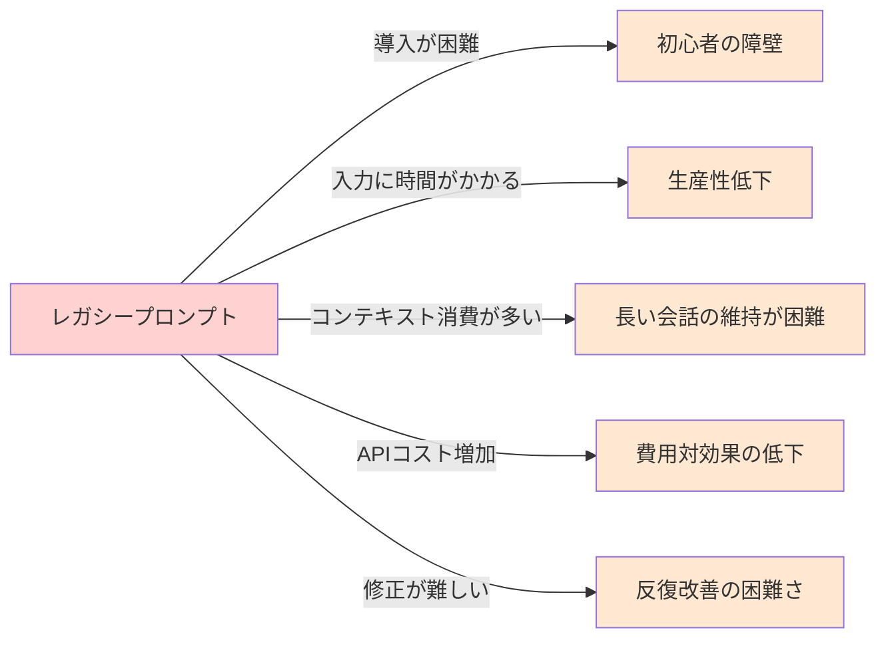
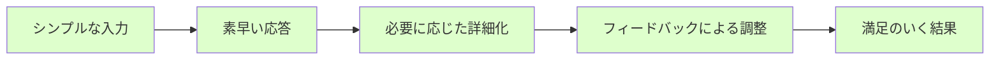
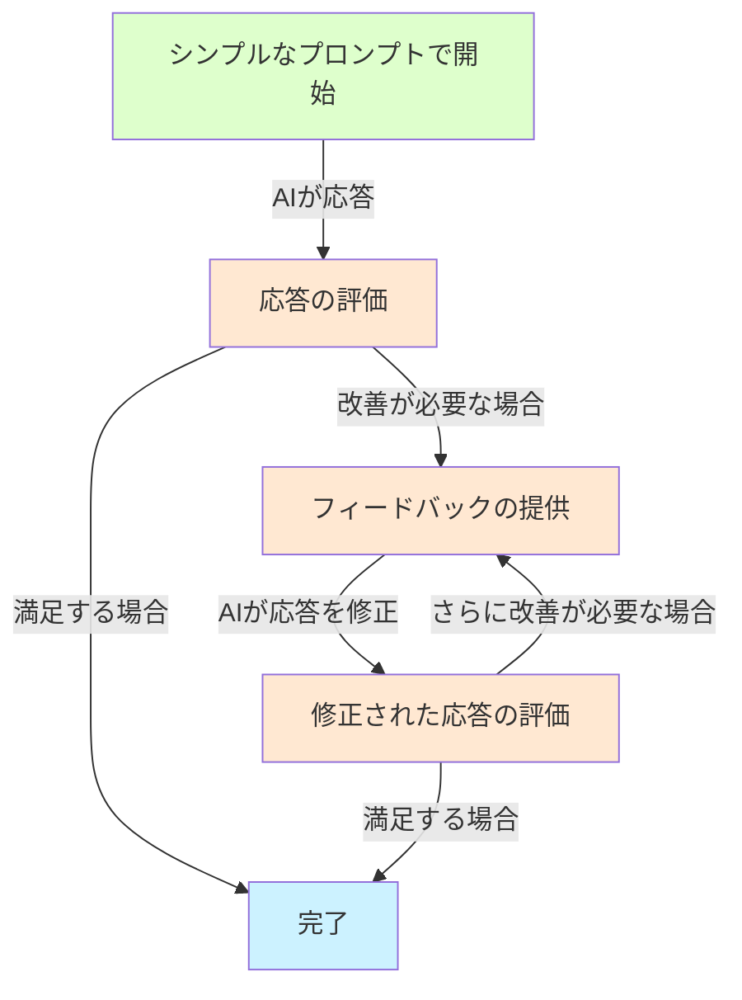
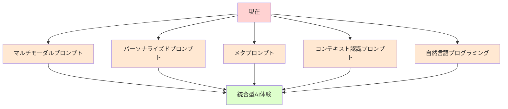
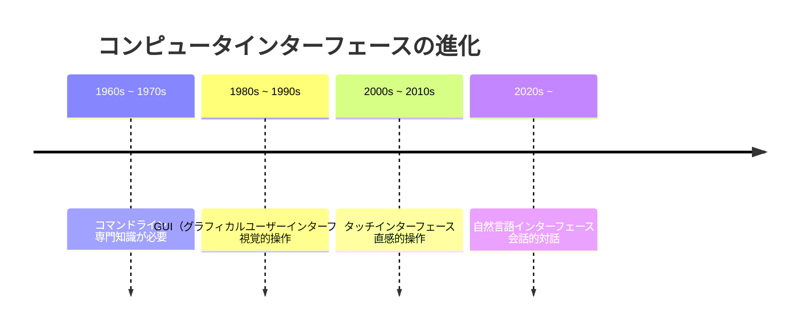
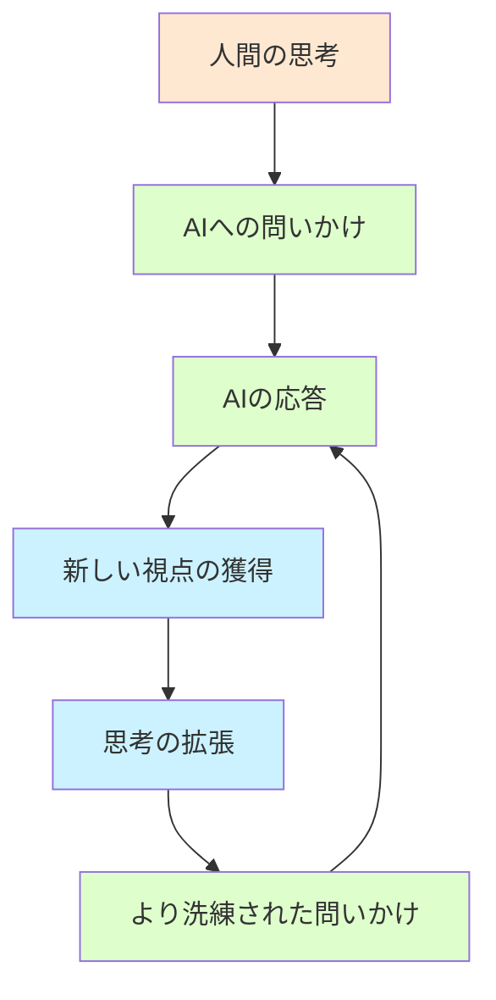
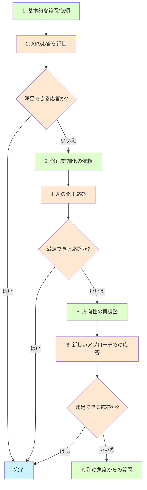
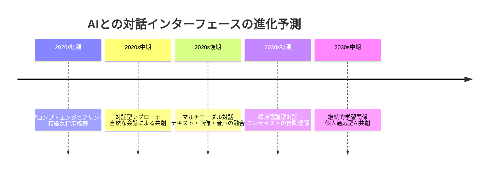
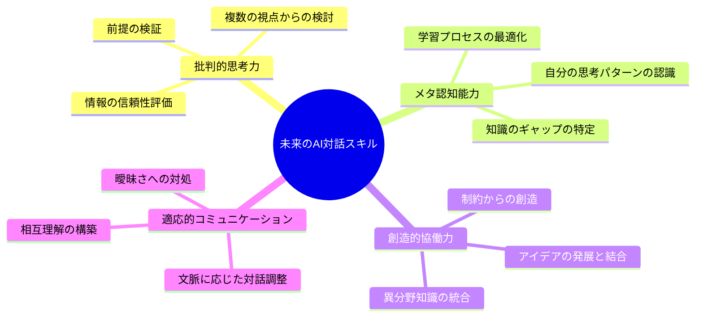
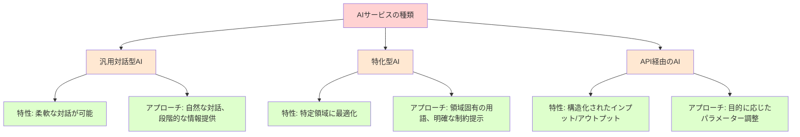

# それってレガシープロンプト：生成AIとの対話を再考する

## はじめに

私たちは今、生成AIという新たな知的パートナーと対話する時代に生きています。ChatGPT、Claude、Bardなどの大規模言語モデル（LLM）の出現により、私たちとテクノロジーの関係性は劇的に変化しました。しかし、多くの人が未だに「黎明期のプロンプト神話」に囚われています。「こう書かなければAIは応答してくれない」「決まったフレーズを使うべき」といった思い込みが、実は私たちとAIの関係性を制限しているかもしれません。

本書は、そんな「レガシープロンプト」の迷信から解放され、より自然で創造的な対話を実現するための指南書です。AIの進化とともに、プロンプトの考え方も進化すべき時が来たのです。

## 第1章：レガシープロンプトという神話

### 1.1 黎明期のプロンプト設計

生成AIが一般に利用可能になった初期、私たちは「魔法の呪文」を探していました。「Act as a...」「You are an expert in...」「I want you to...」といった定型句が広まり、Reddit、Twitter、専門サイトで共有されては「最高のプロンプト」として崇められました。

これらの定型的なプロンプトパターンは、当時のモデルから最大限の性能を引き出すために必要だったかもしれません。初期のモデルは、明示的な指示がなければ意図を正確に捉えることが難しかったからです。

> **コラム：「テンプレコピペあるある」**  
> 
> 私がAIを使い始めた頃、同僚から「効果的なプロンプト」というExcelファイルを渡されました。そこには数十種類のテンプレートが整然と並び、「コピペして下線部を変えるだけ」と書かれていました。最初はありがたく使っていましたが、毎回300文字以上の長文を貼り付け、微修正する作業はとても面倒でした。ある日面倒くさくなって「レポートのアイデアちょうだい」と短く入力したところ、驚くほど良い回答が返ってきて目から鱗が落ちました。同僚たちは今でも冗長なテンプレートを使い続けていますが、私は密かに「ズル」をしています。シンプルな方がはるかに速くて効果的なのに、彼らには言えない秘密です。

### 1.2 「英語神話」の根強さ

レガシープロンプトにまつわる迷信のひとつが「AIには英語で話しかけるべき」というものです。初期のモデルは確かに英語での学習データが豊富でしたが、現代のモデルは多言語対応が格段に向上しています。

```
# レガシープロンプト（英語）
You are an expert copywriter with 20 years of experience in advertising. 
I want you to create a compelling product description for a new smartphone 
that highlights its innovative features, sleek design, and superior camera quality. 
The description should be approximately 200 words, target tech-savvy millennials, 
and include a strong call to action at the end.

# 日本語訳
あなたは広告業界で20年の経験を持つ専門のコピーライターです。
新しいスマートフォンの魅力的な商品説明を作成してください。
革新的な機能、洗練されたデザイン、優れたカメラ品質を強調してください。
説明は約200語で、テクノロジーに詳しいミレニアル世代をターゲットとし、
最後に強力なコールトゥアクションを含めてください。
```

このような英語プロンプトは、特に初期には効果的だと考えられていました。しかし...

> **コラム：「英語プロンプトの罠」**
> 
> あるWebマーケティング会社で勤務していた時、上司は「AIには必ず英語で指示すること」という社内ルールを作りました。「日本語だと細かいニュアンスが伝わらない」というのが理由でした。ある日、キャッチコピー作成の締切に追われた私は、英語でプロンプトを書く時間がなく「このサービスのキャッチコピー、10案ほど考えて」と日本語で入力。すると驚くほど良い案が返ってきました。好奇心から同じ内容を英語で入力してみましたが、結果は大差なし。むしろ、日本向けサービスのキャッチコピーは日本語で考えた方が文化的ニュアンスが自然でした。それ以来、誰にも言わず日本語でプロンプトを書いています。「英語神話」に縛られる必要はなかったのです。

### 1.3 なぜレガシープロンプトが残り続けるのか

レガシープロンプトが今も広く使われている理由はいくつかあります：

1. **初期の成功体験**: 最初に学んだ方法で成功すると、それを変える理由を見出しにくい
2. **共有されるテンプレート**: 「効果的」とされるプロンプトが広く共有され続けている
3. **安心感**: 定型的な手法は予測可能性を与え、不確実性を減らす
4. **モデルの進化への無理解**: AIモデルが急速に進化していることへの認識不足
5. **権威性への信頼**: 「AI専門家」と称する人々が複雑なプロンプトを推奨している

> **コラム：「プロンプト呪術師たち」**
> 
> 先日参加したAI活用セミナーで、講師は「プロンプトエンジニアリングの極意」と題し、スライド20枚を使って「完璧なプロンプトの書き方」を解説していました。複雑な構文、特定の単語の使用順序、文字数の制限など、まるで魔法の呪文のような説明に、参加者は熱心にメモを取っていました。質疑応答で「もっとシンプルにできませんか？」と尋ねると、講師は「プロンプトは芸術であり科学です。この複雑さが必要なのです」と断言。しかしセミナー後、彼のプロンプト例をそのまま使ってみた後、同じ内容を「レポート書いて」と入力してみると、ほぼ同質の結果が得られました。多くの「プロンプト専門家」が複雑さを売りにしていますが、実際には不必要な複雑さを追求しているケースが少なくないようです。

## 第2章：現代のAIモデルの理解

### 2.1 AIの進化：何が変わったのか

最新の生成AIモデルは、初期のモデルとは大きく異なります。特に以下の点で進化しています：

- **コンテキスト理解の向上**: より自然な会話の流れを理解できるようになった
- **暗黙の意図の把握**: 明示的に述べられていないニュアンスも捉えられるようになった
- **推論能力の向上**: 複雑な思考プロセスを要する課題にも対応可能に
- **多様な表現スタイル**: 様々な文体やトーンでの応答が可能に
- **多言語能力の向上**: 日本語を含む非英語言語での理解・生成能力が飛躍的に向上

> **コラム：「過去の呪文で縛られる現代の魔法使い」**
> 
> 先日、大手企業のDX推進部門の方と話す機会がありました。その方は「ChatGPTの使い方」という分厚いマニュアルを見せてくれました。2022年末に作られたそのマニュアルには、びっしりとプロンプトテンプレートが書かれています。「このマニュアルに従わないと使いこなせない」と真剣に語る姿を見て、少し切なくなりました。それは、スマートフォンを使うのに2010年の操作マニュアルに固執しているようなものです。テクノロジーは進化しているのに、私たちの使い方が追いついていないのです。古い呪文に縛られた魔法使いは、新しい魔法の力を十分に発揮できないのかもしれません。

以下は、2022年と2025年のAIモデルへの同じ質問に対する応答の違いを示す例です：

**＜ケーススタディ＞2022年と2025年のAIの応答比較**

```
# 2022年のプロンプト：
You are an expert marketing strategist. I want you to create a comprehensive marketing plan 
for a new coffee shop in Tokyo. The plan should include target audience analysis, 
competitive landscape, promotional strategies, budget allocation, and timeline for implementation. 
Be detailed and specific.

# 日本語訳：
あなたは専門のマーケティング戦略家です。東京の新しいコーヒーショップのための包括的な
マーケティング計画を作成してください。計画にはターゲット層分析、競合状況、
プロモーション戦略、予算配分、実施タイムラインを含めてください。
詳細かつ具体的にしてください。
```

```
# 2025年のプロンプト：
東京で新しいコーヒーショップを開くんだけど、マーケティングプランを考えてもらえる？
```

2022年のAIは詳細な指示がなければ具体的なプランを生成できませんでしたが、2025年のAIは簡潔な依頼からでも充実した内容を提供できます。過度に詳細な指示は、むしろAIの創造性を制限することさえあるのです。

### 2.2 現代のAIが実際に「理解」していること

最新のAIモデルは以下のような高度な理解が可能です：

- **文脈の継続的把握**: 長い会話の中でも一貫性を保てる
- **暗黙的な期待の認識**: 明示されていない要求も推測できる
- **ドメイン知識の適用**: 特定分野の専門知識を適切に活用できる
- **ユーザーの意図の推測**: 不明確な指示でもおおよその意図を把握できる
- **文化的コンテキストの理解**: 日本語特有の曖昧さや婉曲表現の意図を汲み取れる

> **コラム：「AIの成長を見逃すおじさん現象」**
> 
> 私の上司（50代）は、AIに対する最初の失敗体験から抜け出せない典型例です。2022年末に初めてChatGPTを使った時、簡単な質問をしたら的外れな回答が返ってきました。それ以来「AIはまだ使い物にならない」と決めつけ、同僚が勧めても「前に試したけど、ダメだった」の一点張り。子どもの成長を数年見ないうちに「まだあの子は小さい」と思い込むおじさんのようです。テクノロジーの進化速度は私たちの認識更新速度をはるかに上回っています。一度形成された先入観を更新し続けることが、AI時代を生き抜くための重要なスキルかもしれません。

### 2.3 AIモデルの能力マッピング

現代のAIモデルの能力を理解するために、どのような能力が向上したのかを可視化してみましょう。

```mermaid
radar
    title AIモデル能力の進化（2022年→2025年）
    %% スケールは0～10で表示
    %% 内側から外側に：初期モデル→現代モデル
    %% コンテキスト理解
    Context Understanding: 4, 9
    %% 暗黙の意図理解
    Implied Intent: 3, 8
    %% 創造性
    Creativity: 5, 8
    %% 指示への忠実さ
    Instruction Following: 7, 9
    %% 推論能力
    Reasoning: 4, 8
    %% 多言語能力
    Multilingual: 5, 8
    %% 知識の正確さ
    Knowledge Accuracy: 6, 8
    %% 文化的理解
    Cultural Understanding: 3, 7
```

この図からも分かるように、初期モデルは指示に忠実に従うことは得意でしたが、暗黙の意図理解や創造性、文化的理解などは限定的でした。現代のモデルはこれらの能力が大幅に向上し、より自然なコミュニケーションが可能になっています。

## 第3章：レガシープロンプトの問題点

### 3.1 過度な指示が創造性を殺す

レガシープロンプトの最大の問題点は、AIの創造性と思考の幅を狭めてしまうことにあります。

**＜ケーススタディ＞小説の書き出し比較**

```
# レガシープロンプト：
You are a professional novelist specialized in mystery fiction. Write the opening paragraph 
of a mystery novel set in Kyoto during cherry blossom season. The paragraph must include 
a female protagonist, a hint of a murder, and atmospheric description of the setting. 
Use vivid sensory details and create an ominous tone. The paragraph should be between 150-200 words.

# 日本語訳：
あなたはミステリー小説を専門とするプロの小説家です。桜の季節の京都を舞台にした
ミステリー小説の冒頭段落を書いてください。段落には女性の主人公、殺人の暗示、
雰囲気のある舞台設定の描写を含める必要があります。鮮やかな感覚的詳細を使用し、
不吉な調子を作り出してください。段落は150〜200語の間にしてください。

# 現代的プロンプト：
京都の桜の季節を舞台にした、ミステリー小説の冒頭を書いてみて
```

> **コラム：「小説家の制約と自由」**
> 
> 私は趣味で小説を書いていますが、AIを執筆補助に使い始めてから気づいたことがあります。最初は「こういう登場人物で、こういう設定で、こういう展開にして」と細かく指定していました。その結果、技術的には問題ないものの、どこか生気のない文章が返ってきました。試しに「30代の女性が突然異世界に行くお話の書き出し、お願い」と大雑把に頼んでみると、思いもよらない展開や設定が提案されました。プロの小説家の友人は「制約は創造性を高める場合もあるが、過度な制約は創造性を窒息させる」と言います。AIも同じなのかもしれません。私のような素人が考えつかないアイデアをAIが提案してくれることがあり、そこから発想を広げることができます。指示しすぎないことで、AIの創造性を活かせるのです。

### 3.2 冗長性と非効率性

レガシープロンプトのもう一つの問題点は、不必要に長く複雑であることです。

例えば：

```
# レガシープロンプト：
You are an expert chef with 20 years of experience in Italian cuisine. I want you to create a detailed recipe 
for an authentic Italian pasta dish that is suitable for beginners, uses ingredients that are readily available 
in regular supermarkets in Japan, takes less than 45 minutes to prepare, and has a unique twist that makes it 
stand out from common recipes. Include a list of all ingredients with precise measurements, step-by-step cooking 
instructions, potential substitutions for dietary restrictions, and tips for presentation.

# 日本語訳：
あなたはイタリア料理で20年の経験を持つ専門シェフです。初心者に適した本格的なイタリアンパスタ料理の
詳細なレシピを作成してください。日本の一般的なスーパーマーケットで簡単に入手できる材料を使用し、
準備に45分未満かかり、一般的なレシピとは一線を画すユニークなひねりを加えてください。
正確な測定値を含むすべての材料のリスト、ステップバイステップの調理手順、食事制限に対する
潜在的な代替品、プレゼンテーションのためのヒントを含めてください。

# 現代的プロンプト：
日本のスーパーで買える材料で作れる、初心者向けの少し変わったイタリアンパスタのレシピを教えて
```

AIは「初心者向け」「イタリアン」「パスタ」「レシピ」「日本のスーパー」「少し変わった」というキーワードから必要なコンテキストを理解し、適切な応答を生成できます。長い前置きや細かい指定は、多くの場合不要なのです。

> **コラム：「企画書の呪縛」**
> 
> マーケティング部門で働く友人は、AIを使って企画書のドラフトを作成する際に面白い発見をしました。当初は「企画書テンプレート」として保存していた1000字を超える詳細なプロンプトを使っていましたが、ある日急いでいて「新商品のSNSキャンペーン企画、ターゲットは20代女性、美容と健康に関心あり」と簡潔に入力したところ、いつも以上に斬新なアイデアが含まれた企画書が返ってきたのです。彼女が気づいたのは、詳細すぎる指示が「前例踏襲バイアス」を生んでいたこと。AIに与える自由度を高めることで、人間が思いつかなかった切り口が提案されるようになりました。今では企画の初期段階ではあえてシンプルなプロンプトを使い、アイデアの幅を広げる戦略を取っているそうです。

### 3.3 ユーザー体験の低下

冗長なプロンプトは、AI利用のユーザー体験を大きく低下させます：

1. **入力の手間**: 長文を入力するのは時間がかかる
2. **コンテキスト消費**: 長いプロンプトはコンテキストウィンドウを消費する
3. **修正の困難さ**: 詳細なプロンプトは微調整が難しい
4. **応答時間の増加**: 長いプロンプトは処理時間が長くなる
5. **コスト増加**: APIを使用する場合、トークン数に応じて料金が発生



> **コラム：「プロンプト作成に1時間、AIとの対話に5分」**
> 
> あるマーケティング会議で、同僚がAIを使って市場分析を行うというデモンストレーションを行いました。彼は「効果的なプロンプトの作成」について15分間説明した後、画面共有で実際のプロンプトを入力し始めました。下書きしておいたWord文書から500字以上のテキストをコピー＆ペーストし、さらに5分かけて微調整。ようやくAIに送信したところで「このプロンプトの準備に1時間かかりました」と誇らしげに語りました。AIの回答は確かに良質でしたが、会議後、別の同僚が小声で「あんな準備をするなら、自分で分析した方が早いのでは？」とつぶやいていました。これこそレガシープロンプトの本質的な問題です。AI活用の本来の目的は効率化なのに、プロンプト作成自体が非効率な作業になってしまうのです。

## 第4章：現代的プロンプトの原則

### 4.1 シンプルから始める

現代的なプロンプト設計の第一原則は「シンプルから始める」ことです。

- まずは最もシンプルな形で質問や依頼を表現する
- 必要に応じて詳細を追加していく
- AIの応答を見て、方向性の調整や詳細化を行う

人間同士の自然な会話と同じように、一度にすべてを伝えようとするのではなく、対話を通じて徐々に意図を明確にしていく方がより効果的です。

```
# レガシーアプローチ
You are a professional data analyst with expertise in Python and data visualization. 
I want you to analyze the following sales data for a retail company. 
The data includes monthly sales figures for the past 3 years across 5 different product categories. 
Please provide a comprehensive analysis including trends, seasonality, growth rates by category, 
and identify the best and worst performing products. Include Python code for data processing 
and visualization using matplotlib and seaborn. The visualizations should include line charts 
for trends, bar charts for category comparisons, and heatmaps for correlation analysis.

# 現代的アプローチ
この小売業の売上データを分析してもらえる？
（AIの応答を見てから）
季節性と商品カテゴリごとの傾向も見たいな
（さらに応答を見て）
可視化するためのPythonコードも添えてくれる？
```

> **コラム：「AIとの会話は人間との会話に似ている」**
> 
> 先日、70代の母がAIを初めて使う様子を見ていて気づいたことがあります。「どうやって話しかけたらいいの？」と聞くので、「普通に話しかければいいよ」と答えると、母は信じられないという表情でした。彼女がパソコンを使い始めた時代は、コンピュータに正確なコマンドを入力しないと動かなかった時代。「えっと...レシピを...教えてください...カレー...簡単な...」と途切れ途切れに入力していました。数回のやり取りを見ていると、徐々に自然な会話調になっていきました。最後には「あら、本当に普通に話せるのね」と驚いていました。母のこの体験は、多くの人がAIに対して持つ先入観を表しています。新しいテクノロジーには新しい対話方法が必要だと思い込んでいるのです。実際には、AIとの対話は人間同士の自然な会話に近づいているのです。

### 4.2 対話的アプローチ

現代のAIとの対話は、一方的な指示ではなく双方向のコミュニケーションです。

**対話的プロンプトの例：**

```
1. ユーザー：「マーケティング計画の作成を手伝ってほしい」
2. AI：「どのような商品やサービスのマーケティング計画ですか？」
3. ユーザー：「うちの会社はエコ商品を扱ってるから、その点を強調したいな」
4. AI：（エコフレンドリーな要素を取り入れた計画の概要を提案）
5. ユーザー：「ターゲット層はもう少し若い世代に絞りたいかも」
6. AI：（若年層向けの要素を追加・調整した計画を提案）
```

このように段階的に情報を提供し、AIの応答を見ながら方向性を微調整していくアプローチは、一度に完璧なプロンプトを作成しようとするよりも効率的で、より満足度の高い結果につながります。

> **コラム：「最高の料理人と最高の注文の仕方」**
> 
> 私の友人は高級寿司店のカウンターで調理する寿司職人です。彼が言うには、最高の食事体験を得るお客様は大きく二つのタイプに分かれるそうです。一つは「おまかせで」と言って職人の腕を信頼するタイプ。もう一つは「今日はこんな気分です」と自分の好みや気分を伝えつつも、具体的な内容は職人に委ねるタイプ。逆に最も満足度が低くなりがちなのは、最初から最後まで細かく指定するお客様だそうです。「この魚をこう切って、この調味料でこう味付けして」と指示されると、職人の創造性や経験が活かせないからです。AIとの対話も同じではないでしょうか。最高の結果を得るには、AIの「腕前」を信頼し、方向性や好みは伝えつつも、細部まで指示しすぎないことが重要なのかもしれません。

### 4.3 AIの強みを活かす

現代的プロンプトの重要な視点は、AIの強みを理解し活用することです。

- **生成的思考**: AIに選択肢や可能性を広げる余地を与える
- **情報の構造化**: 大量の情報を整理・分類する能力を活用する
- **多様な視点の提供**: 異なる観点からの検討を依頼する
- **反復的改善**: フィードバックを通じて回答を洗練させる

**＜ケーススタディ＞問題解決アプローチの比較**

```
# レガシープロンプト：
You are a strategic problem solver. I want you to analyze the issue of high employee turnover 
in a tech company using the following frameworks: SWOT analysis, 5 Whys, and Fishbone diagram. 
For each framework, provide a detailed analysis with at least 5 points per category. 
Then synthesize your findings into a comprehensive action plan with immediate, short-term, 
and long-term recommendations.

# 日本語訳：
あなたは戦略的な問題解決者です。SWOT分析、5つのなぜ、特性要因図の枠組みを使用して、
テクノロジー企業における従業員の高い離職率の問題を分析してください。それぞれの枠組みに対して、
カテゴリごとに少なくとも5つのポイントを含む詳細な分析を提供してください。
次に、即時、短期、長期の推奨事項を含む包括的なアクションプランにあなたの調査結果を統合してください。

# 現代的プロンプト：
IT企業の離職率が高いんだけど、この問題をいろんな角度から分析してみてくれる？
```

現代的なアプローチでは、AIに分析の枠組みを選ばせることで、より適切で創造的な解決策が生まれる可能性が高まります。

### 4.4 ユーザー体験を優先する

現代的プロンプトの重要な視点は、AIとの対話全体のユーザー体験（UX）を向上させることです。



この流れは、一度に完璧なプロンプトを作成しようとするアプローチよりも、全体としてより少ない時間と労力で、より満足度の高い結果につながります。

> **コラム：「AIプロンプトのアジャイル開発」**
> 
> ソフトウェア開発では、かつての「ウォーターフォール型」（全てを事前に完璧に計画する）から「アジャイル型」（小さく始めて反復的に改善する）への移行が起きました。AIプロンプトにも同じパラダイムシフトが起きています。私のチームでは「プロンプトのアジャイル開発」と呼んでいますが、最初は最小限のプロンプトから始め、AIの応答を見ながら対話的に改良していくアプローチです。これにより、想定外の良いアイデアが生まれたり、より効率的に目的を達成できたりすることが多いのです。レガシープロンプトの長大な「仕様書」作成に時間をかけるよりも、小さく始めて素早くフィードバックを得るサイクルの方が、結果的に優れた成果につながっています。

## 第5章：レガシープロンプトが適している場面

すべての場面で現代的プロンプトが優れているわけではありません。レガシープロンプトが依然として有効、あるいは必要な状況もあります。

### 5.1 精度と一貫性が最重要の場合

- **法的文書や契約書の作成**
- **医療情報や安全手順の説明**
- **技術的なマニュアルや手順書**
- **財務レポートや監査文書**

これらの場合、AIに創造的な自由度を与えるよりも、厳密な枠組みを提供する方が適切です。

```
# この場合は詳細な指示が適切
あなたは医療文書の専門家です。糖尿病患者向けの血糖値管理ガイドラインを作成してください。
以下の要素を必ず含めてください：
1. 血糖値の正常範囲と危険値
2. 測定の頻度と適切なタイミング
3. 低血糖症状とその対処法
4. 高血糖症状とその対処法
5. 医師に連絡すべき緊急事態の基準
6. 食事と運動の記録方法
文書は医学的に正確でなければならず、最新の臨床ガイドラインに準拠している必要があります。
専門用語は必要最小限にし、一般の患者でも理解できる平易な表現を使用してください。
```

> **コラム：「精度が命の場面」**
> 
> 医療系のテクニカルライターとして働く知人は、AIを使って患者向け説明資料の下書きを作成しています。彼女によると「この分野では曖昧さが許されない」とのこと。投薬量や副作用の説明などでは、言葉選びひとつで患者の健康や生命に関わるため、詳細かつ明確な指示が必須だそうです。彼女は「創造性より正確さ」を重視し、医学用語の定義や表現方法をプロンプトで細かく指定します。この例は、AIの用途や目的によって最適なプロンプト戦略が異なることを教えてくれます。一方で、患者向けの病気の理解を助ける比喩や説明例を考える際には、AIに自由度を与える方がより分かりやすく印象に残る表現が得られると言います。同じ医療分野でも、目的によってプロンプト戦略を使い分けているのです。

### 5.2 特殊なフォーマットやスタイルの指定

特定のフォーマットに厳密に従う必要がある場合、詳細な指示が有効です：

- **特定の引用スタイル（APA、MLA、Chicagoなど）の使用**
- **企業の特定のブランドガイドラインへの準拠**
- **厳格な文字数制限のある文書**
- **特定の構造や専門的なフォーマットが要求される文書**

```
# フォーマットが重要な場合のプロンプト例
次の研究論文の要約をAPA形式で引用を含めて作成してください。
各セクションは200字以内にまとめ、キーワードを5つ含めてください。
論文タイトル：「人工知能を活用した教育パーソナライゼーションの効果：日本の高等教育機関における実証研究」
著者：山田太郎、鈴木花子
発行年：2023
ジャーナル：Journal of Educational Technology
巻（号）：45(3)
ページ：123-145
DOI：10.1234/jet.2023.45.3.123
```

### 5.3 バイアスの最小化が必要な場合

センシティブなトピックを扱う際、AIのバイアスを減らすために明示的な指示が役立つことがあります：

- **政治的なトピックの中立的分析**
- **多様な視点を含むべき社会問題の説明**
- **文化的センシティビティが求められる内容**
- **論争のある話題についての均衡の取れた議論**

> **コラム：「レガシーとモダンの使い分けの妙」**
> 
> 大手広告代理店でコピーライターとして働く友人は、AIの活用法にこだわりを持っています。クライアントの業界分析や背景調査ではシンプルなプロンプトを使い、AIの知識と推論能力を最大限に活用。一方、法的な免責事項や規制業界（医薬品、金融など）の広告文を作成する際は、業界特有の表現ルールや禁止ワードを細かく指定した詳細なプロンプトを使用します。「AIは共同作業者であり、状況に応じてコミュニケーション方法を変えるのは当然」と彼女は言います。これこそが現代のAI活用の本質なのかもしれません。固定的な「正しいプロンプト」を追求するのではなく、目的や状況に応じて柔軟に使い分けることが大切なのです。

## 第6章：効果的な現代的プロンプトの実践例

### 6.1 ビジネス領域での応用

**企画会議のアイデア出し**

```
# レガシープロンプト：
You are an experienced innovation consultant with expertise in design thinking. 
Generate 10 innovative product ideas for a sustainable kitchenware brand targeting millennials. 
Each idea should include a product name, key features, unique selling proposition, 
potential price point, and ecological benefits. Ensure the ideas are feasible to manufacture, 
aligned with current market trends, and solve real problems faced by the target demographic.

# 日本語訳：
あなたは設計思考に関する専門知識を持つ経験豊富なイノベーションコンサルタントです。
ミレニアル世代をターゲットにした持続可能なキッチンウェアブランドのための10の革新的な
製品アイデアを生成してください。各アイデアには、製品名、主な機能、独自の販売提案、
潜在的な価格帯、および生態学的利点を含める必要があります。アイデアが製造可能であり、
現在の市場トレンドに沿っており、ターゲット層が直面する実際の問題を解決することを確認してください。

# 現代的プロンプト：
ミレニアル世代向けのサステナブルなキッチン用品のアイデアをブレストしたいんだけど
```

**＜ケーススタディ＞実際の企業での導入結果**

あるデザイン会社では、週次のアイデア会議でLLMを活用していましたが、当初は詳細なプロンプトテンプレートを使用していました。しかし、シンプルなプロンプトに切り替えたところ、会議の準備時間が75%削減され、より多様で予想外のアイデアが生まれるようになりました。

> **コラム：「テンプレ依存症からの解放」**
> 
> IT企業で働く私の友人は、プロジェクト提案書の作成でAIを活用していましたが、常に同じテンプレートを使い続けていました。ある日「このテンプレート、結局いつも同じような提案になってない？」と気づき、試しに「クラウドセキュリティ強化のための革新的なアプローチを考えて」とシンプルに尋ねてみました。すると、テンプレートでは出てこなかった斬新なアイデアが返ってきたのです。「テンプレートが思考の型枠になっていた」と彼は言います。シンプルなプロンプトによって、AIだけでなく自分自身の発想の幅も広がったと感じたそうです。現在は、最初のアイデア出しではあえてシンプルに問いかけ、その後で必要に応じて詳細を指定するハイブリッドアプローチを取っています。このように、プロンプトの進化は私たちの思考プロセスの進化にもつながるのです。

### 6.2 教育現場での応用

**授業計画の作成**

```
# レガシープロンプト：
You are an experienced high school science teacher with a specialization in biology. 
Create a detailed lesson plan for a 60-minute class on photosynthesis for 10th grade students. 
The plan should include learning objectives aligned with national science standards, 
a warm-up activity (5-10 minutes), main instructional content with key concepts and scientific terminology, 
an interactive student activity, assessment methods, and homework assignment. 
Include timing for each section, required materials, and accommodations for different learning styles.

# 日本語訳：
あなたは生物学を専門とする経験豊富な高校の理科教師です。
高校2年生向けの光合成に関する60分の授業の詳細な指導案を作成してください。
計画には、全国科学基準に沿った学習目標、ウォームアップ活動（5〜10分）、
主要な概念と科学用語を含む主要な指導内容、インタラクティブな生徒活動、
評価方法、および宿題の割り当てを含める必要があります。
各セクションのタイミング、必要な材料、および異なる学習スタイルへの対応を含めてください。

# 現代的プロンプト：
高校2年生に光合成について教える授業案を考えてるんだけど、アイデアある？
```

シンプルなプロンプトから始め、AIの提案を見ながら「もう少し実験的な要素を入れたい」「覚えやすい比喩があるといいな」など対話的に発展させることで、より創造的で実践的な授業計画が生まれます。

> **コラム：「教育者のAI活用術」**
> 
> 高校で生物を教えている知人は、当初AIを使う際に「完璧な授業計画」を一発で得ようとしていました。彼女のプロンプトは学習指導要領の項目を全て列挙し、授業の流れを細かく指定するもので、入力だけで15分ほどかかっていたそうです。しかし、ある研修会でシンプルなプロンプトから始めて対話的にアイデアを発展させる方法を学んでから、彼女のAI活用法は大きく変わりました。「以前は既存の授業案の焼き直しになりがちだったけど、今はAIとの対話から思いもよらないアクティビティのアイデアが生まれる」と彼女は言います。特に印象的だったのは、光合成の授業で「スマホのバッテリーと太陽エネルギーの比較」という導入を提案されたこと。生徒の身近な経験と結びつけることで、抽象的な概念への興味を引き出すことができたそうです。シンプルな問いかけから始めることで、AIの創造性と教育者の専門知識が融合した、より効果的な学習体験が生まれているのです。

### 6.3 創造的分野での応用

**小説執筆のサポート**

```
# レガシープロンプト：
You are a professional fiction editor with expertise in character development. 
Analyze the protagonist in my novel draft and provide detailed feedback on their character arc, 
motivations, internal conflicts, external obstacles, growth trajectory, and believability. 
Identify specific scenes where character development could be strengthened and suggest revisions 
that would enhance reader engagement while maintaining consistency with the established character traits. 
Provide at least 3 examples of successful character development from bestselling novels in the same genre for comparison.

# 日本語訳：
あなたはキャラクター開発の専門知識を持つプロの小説編集者です。
私の小説の草稿の主人公を分析し、キャラクターの弧、動機、内部葛藤、外部障害、
成長軌跡、信頼性について詳細なフィードバックを提供してください。
キャラクター開発を強化できる特定のシーンを特定し、確立されたキャラクターの特性との
一貫性を維持しながら読者の関与を高める改訂を提案してください。
比較のために、同じジャンルのベストセラー小説からの成功したキャラクター開発の例を少なくとも3つ提供してください。

# 現代的プロンプト：
書いてる小説の主人公がどうも平面的に感じるんだけど、もっと魅力的にする方法ない？
```

創造的な作業では特に、AIに具体的なアイデアや選択肢を考える余地を与えることで、執筆者自身が思いつかなかった視点や解決策が提示されることがあります。

> **コラム：「作家とAIの共創空間」**
> 
> あるミステリー作家の友人は、AIとの対話方法を変えたことで創作の行き詰まりを打破したと話してくれました。以前は「ミステリー小説のプロットを考えて、以下の要素を含めること：女性探偵、閉鎖的な島の村、古い呪いの伝説...」といった具体的な指示をしていましたが、得られるのは既存の作品の組み合わせのような平凡なプロットばかり。しかし「探偵小説を書いていて、意外性のあるトリックを思いつかないんだけど」というシンプルな悩みを投げかけたところ、AIから「では主人公の探偵自身が無意識のうちに犯人だったらどうでしょう？二重人格や記憶喪失の要素を...」という斬新な提案があり、新たな創作の方向性が開けたそうです。AIをプロットの「発注先」ではなく「ブレインストーミングの相手」と捉えることで、より創造的な共創が可能になるのだと彼女は言います。

### 6.4 日常生活での応用

**レシピ提案と調理アドバイス**

```
# レガシープロンプト：
You are a professional chef with expertise in Japanese home cooking. 
I want you to create a detailed recipe for a nutritious weeknight dinner 
that can be prepared in under 30 minutes, uses ingredients commonly found 
in Japanese supermarkets, and appeals to both adults and children. 
The meal should be balanced with proteins, vegetables, and carbohydrates, 
and should have a good mix of flavors and textures. 
Provide a complete ingredients list with measurements, step-by-step cooking instructions, 
nutritional information, and suggestions for possible variations to accommodate dietary restrictions.

# 日本語訳：
あなたは日本の家庭料理の専門知識を持つプロのシェフです。
30分以内に準備でき、日本のスーパーで一般的に見られる材料を使用し、
大人と子供の両方に魅力的な栄養価の高い平日の夕食の詳細なレシピを作成してください。
食事はタンパク質、野菜、炭水化物でバランスが取れており、
風味と食感のバランスが良いものである必要があります。
測定値を含む完全な材料リスト、段階的な調理手順、栄養情報、
および食事制限に対応するための可能なバリエーションの提案を提供してください。

# 現代的プロンプト：
冷蔵庫に卵、キャベツ、豚肉があるんだけど、子供も喜ぶ簡単な夕食のレシピない？
```

日常的な質問では特に、シンプルなプロンプトの方が自然で使いやすいことが多いです。必要に応じて「アレルギーがあるから大豆は使わないでほしい」「塩分控えめにしたい」など、追加情報を会話の流れの中で伝えることができます。

> **コラム：「料理と会話の共通点」**
> 
> 料理教室を主宰している知人は、「レシピの伝え方」と「AIへのプロンプト」に共通点を見出しています。料理初心者に詳細なレシピを一度に全部説明すると、情報過多で混乱することが多いそうです。同様に、AIに細かすぎる指示を出すと、本質的なポイントが埋もれてしまうことがあります。彼女の料理教室では「まず何を作りたいですか？」と生徒に尋ね、基本的な工程を説明した後、生徒の反応を見ながら詳細を追加していくアプローチを取っています。「料理もAIも、対話を通じて徐々に完成形に近づいていくもの。一方的に指示するのではなく、相手の反応を見ながら調整していくことが大切」と彼女は言います。この「対話的アプローチ」は、現代のAIとのコミュニケーションにも通じる知恵なのでしょう。

## 第7章：効果的なプロンプト設計のための実践ガイド

### 7.1 現代的プロンプトの基本パターン

効果的な現代的プロンプトには、いくつかの基本パターンがあります。以下に主なパターンとその例を示します。

**1. 「〜について教えて」パターン**

```
量子コンピューティングの基本について教えて
```

**2. 「〜したい」パターン**

```
週末に京都を観光したいんだけど、おすすめのスポットを知りたい
```

**3. 「〜を手伝って」パターン**

```
履歴書の書き方を手伝ってもらえる？
```

**4. 「〜を考えて」パターン**

```
新しい飲食店のコンセプトを考えてほしい
```

これらのシンプルなパターンから始め、必要に応じて情報を追加していくアプローチが効果的です。

> **コラム：「シンプルなのに奥深いプロンプトの世界」**
> 
> 私がAIを活用するワークショップを開催した際、参加者から「そんな短いプロンプトで大丈夫なんですか？」という質問をよく受けます。試しに「SDGsについて教えて」と入力すると、多くの参加者は「もっと詳細に指定すべきでは？」と疑問を持ちます。しかし、AIの応答を見て、その内容の質と網羅性に驚きの声が上がります。さらに「環境に関する目標に絞って説明して」「具体的な企業の取り組み例を教えて」と会話を発展させていくと、「まるで専門家と話しているよう」という感想が聞かれます。シンプルなプロンプトは、決して「雑」なのではなく、対話の入り口として最適なのです。言葉を尽くして説明するよりも、実際に体験してもらうことで、現代的プロンプトの効果を実感していただいています。

### 7.2 プロンプトの反復的改善プロセス

効果的なプロンプトは一度で完成するものではなく、対話を通じて改善していくものです。以下に反復的改善のプロセスを示します。



**具体例：ブログ記事の作成**

```
1. ユーザー：「SDGsに関するブログ記事を書いてほしい」
2. AI：（基本的なSDGsに関する記事を生成）
3. ユーザー：「環境関連の目標にフォーカスして、もう少し具体的な事例も入れてほしい」
4. AI：（環境関連の目標に焦点を当て、具体例を追加した記事を生成）
5. ユーザー：「最後に読者へのアクションプランも追加してもらえる？」
6. AI：（アクションプランを追加した完成版の記事を生成）
```

この対話的なアプローチでは、AIの創造性を活かしながら、ユーザーの意図に沿った成果物に徐々に近づけていくことができます。

> **コラム：「AI対話の黄金比率」**
> 
> 企業のAI活用コンサルタントをしている友人は、「効果的なAI対話には黄金比率がある」と言います。最も生産的な対話は、AIに情報や方向性を提供しつつも、十分な自由度を残すバランスが取れている場合だそうです。彼の経験則では「7:3の法則」があり、目的の7割を明確に伝え、3割は AIに委ねるのが理想的だとのこと。例えば「環境に優しい製品のマーケティング戦略を考えて（7割の明確さ）」とし、具体的な戦略の内容はAIの創造性に委ねる（3割の自由度）。このバランスが崩れると、「5:5」では曖昧すぎて的外れな結果になりがちで、「9:1」では指示が多すぎてAIの創造性が発揮されないと言います。この黄金比率は分野や目的によって変動しますが、プロンプト設計の指針として参考になりそうです。

### 7.3 異なるAIモデルへの適応

異なるAIモデルには、それぞれ特性があります。以下は主要なモデルタイプに応じたプロンプト調整のポイントです。

**1. 汎用大規模言語モデル（ChatGPT、Claude等）**
- シンプルで自然な対話が基本
- 専門分野の質問でも基本はシンプルに

**2. 特化型AI（コード生成、画像生成等）**
- 目的に応じた具体的な指示が効果的
- 出力フォーマットの指定が重要な場合も

**3. 旧世代モデル**
- より明示的な指示が必要な場合も
- 複雑なタスクは分割して依頼する

> **コラム：「親切なレストランと気難しいレストラン」**
> 
> 異なるAIモデルへの対応を私は「レストランの注文」に例えて説明しています。最新の高性能モデルは「親切なレストラン」のようなもの。「何か軽いランチが食べたい」と言えば、おすすめを提案してくれる。一方、旧世代や特化型のモデルは「気難しいレストラン」に似ています。「パスタを注文したい。トマトソースで、アルデンテで、パルメザンチーズを多めに」と具体的に注文する必要があります。どちらが良い悪いではなく、相手の「性格」に合わせたコミュニケーションが大切なのです。私たちは人間同士でも無意識にこうした調整をしています。友人との会話と上司への報告では話し方を変えるように、AIモデルの特性に合わせてプロンプトを調整することで、より良い結果が得られるのです。

## 第8章：プロンプトの進化と未来

### 8.1 プロンプト設計の今後の展望

プロンプト設計は今後も進化し続けるでしょう。想定される方向性としては：

- **マルチモーダルプロンプト**: テキストだけでなく、画像や音声、動作を組み合わせた指示
- **プロンプトのパーソナライゼーション**: 個人の好みや過去の対話履歴に基づく調整
- **メタプロンプト**: AIが最適なプロンプトを提案する仕組み
- **コンテキスト認識プロンプト**: 状況や環境を認識して最適化されるプロンプト
- **自然言語プログラミング**: プロンプトを通じたソフトウェア開発



> **コラム：「プロンプトから対話へ、そして共創へ」**
> 
> テクノロジー評論家の友人は、AIとの対話の進化について興味深い見解を持っています。「プロンプトという言葉自体がいずれ古くなるだろう」と彼は言います。人間同士の会話で「私はあなたにプロンプトを送ります」とは言わないように、AIとの自然な対話が当たり前になれば、特別な「プロンプト技術」という概念自体が薄れていくかもしれません。彼の予測では、将来のAIとのコミュニケーションはより双方向的になり、AIが質問を投げかけたり、理解を確認したり、創造的な提案をしたりする「共創的な対話」に発展するとのこと。テクノロジーの進化によって、プロンプトという概念自体が「レガシー」になる日が来るかもしれないのです。皮肉なことに、この本のタイトル自体がいつか「レガシー」になる可能性があります。

### 8.2 AIリテラシーの重要性

テクノロジーの進化とともに、私たちのAIリテラシーも進化する必要があります：

- AIの特性と限界の理解
- 効果的なコミュニケーション方法の習得
- 批判的思考とAI出力の評価能力
- AIとの創造的コラボレーションスキル
- 倫理的な利用と社会的影響の認識

これらのリテラシーは、単なるテクニカルスキルではなく、AIとの共存時代における重要な「リベラルアーツ」と言えるでしょう。

> **コラム：「プロンプトリテラシーと現代の読み書き能力」**
> 
> 教育工学の研究者である知人は、「プロンプトリテラシーは現代の読み書き能力の一部になりつつある」と指摘します。かつて手紙の書き方が社会人の基本スキルだったように、AIとの効果的なコミュニケーション方法は現代社会の基礎的能力になると彼女は予測しています。特に注目すべきは、良いプロンプトを書く能力が「クリエイティブスキル」と「分析的思考」の両方を要求すること。自分の意図を明確に伝えるための論理的思考と、AIの可能性を最大限に引き出すための創造的発想が必要なのです。彼女は学校教育にこそ「AIとの対話法」を取り入れるべきだと提案しています。子どもたちが早い段階でAIとの健全な対話を学ぶことで、テクノロジーに振り回されるのではなく、テクノロジーを活用して自らの可能性を広げる力を身につけられるからです。

## 結論：レガシーからの解放

プロンプトの設計は、AIの進化とともに変化しています。「魔法の呪文」としてのレガシープロンプトから脱却し、より自然で対話的なアプローチに移行することで、AIの真の可能性を引き出すことができます。

完璧なプロンプトを一度に作り上げようとするのではなく、人間同士の会話のように、シンプルな問いかけから始め、対話を通じて理解を深めていく。そんなアプローチが、AIとの創造的で生産的な関係を築く鍵となるでしょう。

「レガシープロンプト」に固執するのではなく、常に新しい可能性を探り、実験し、学び続ける姿勢こそが、急速に発展するAI時代において最も価値のあるスキルなのかもしれません。

> **コラム：「AIとの対話は人間性の発揮」**
> 
> 人工知能研究の第一人者である教授は、「AIとの対話は、人間であることの本質を再認識する機会になる」と語ります。彼によれば、レガシープロンプトのような固定的・機械的な対話法は、私たち自身が「機械のように」振る舞おうとする矛盾を含んでいるとのこと。対照的に、現代的な対話型アプローチは、人間ならではの適応力や文脈理解、創造的思考を活かしたものです。「私たちが最も人間らしく振る舞うとき、AIとの対話は最も生産的になる」という彼の言葉は、技術の進化と人間性の調和を示唆しているように思えます。AIとの対話を通じて、私たちは自分自身の思考プロセスや創造性、コミュニケーション能力を再発見する機会を得ているのかもしれません。

## 付録：効果的なプロンプト設計のチェックリスト

### 現代的プロンプトの基本原則チェックリスト

- □ シンプルな表現から始めているか
- □ 対話的なアプローチを意識しているか
- □ AIの創造性を活かせる余地があるか
- □ 必要な制約は明確に伝えているか
- □ 文脈から推測できる情報を冗長に説明していないか
- □ 目的に応じてレガシー/現代的アプローチを使い分けているか
- □ フィードバックを通じて改善しているか

### 目的別プロンプト設計ガイド

**創造的タスク向け**
- □ 具体的な制約よりも方向性の提示を優先
- □ AIの提案から着想を得る余地を残す
- □ 複数のアイデアを生成してもらい選択肢を広げる
- □ 対話を通じて徐々に具体化していく

**分析・調査タスク向け**
- □ 分析の目的を明確に伝える
- □ 特定の観点がある場合は示す
- □ データや情報源の制約がある場合は伝える
- □ 必要な詳細度や形式を指定する

**技術的タスク向け**
- □ 必要なフォーマットや規格を明示
- □ エラー処理や例外ケースへの対応を指定
- □ 互換性や環境の制約を伝える
- □ 参考になる既存実装やドキュメントを示す

**教育・説明タスク向け**
- □ 対象読者のレベルを伝える
- □ 説明に含めるべき重要概念を示す
- □ 望ましい例示や比喩のスタイルを伝える
- □ 質問形式で段階的に理解を深める

## 第9章：AI時代のコミュニケーション革命

### 9.1 自然言語インターフェースの台頭

生成AIの進化により、コンピュータとの対話方法は根本的に変わりつつあります。コマンドラインやGUIに代わり、自然言語インターフェース（NLI）が新たな標準になりつつあります。



この変化は、技術と人間の関係性の根本的な変革を意味します。かつては人間が機械の「言語」を学ぶ必要がありましたが、今や機械が人間の言語を理解するようになりました。

> **コラム：「祖母とAIアシスタント」**
> 
> 技術に疎い80代の祖母が、音声AIアシスタントを驚くほど自然に使いこなしている様子を見て衝撃を受けました。パソコンのマウス操作すら難しかった祖母が、「今日の天気は？」「明日の予定を教えて」と話しかけ、情報を得ています。彼女が言うには「これまでの機械は私に合わせてくれなかったけど、これは私の言うことを聞いてくれる」とのこと。祖母にとっては複雑なUIや操作方法を覚える必要がなく、生まれてからずっと使ってきた「会話」というインターフェースで技術にアクセスできることが革命的だったのです。自然言語インターフェースの台頭は、技術の民主化と言えるかもしれません。これまで技術的障壁によってデジタル世界から疎外されていた人々が、言葉という最も基本的なツールを通じて参加できるようになるのですから。

### 9.2 プロンプトからの脱却：対話型インターフェースの未来

「プロンプト」という概念自体が過渡期のものかもしれません。将来的には、より自然な対話体験へと進化していく可能性があります。

**現在のプロンプトベースモデル：**
- ユーザーが質問や指示を入力
- AIが応答を生成
- 基本的に一方向のコミュニケーション

**将来の対話型インターフェース：**
- AIが積極的に質問や提案をする
- ユーザーの意図や文脈を継続的に学習
- 協働的な問題解決やクリエイティブプロセス

> **コラム：「AIとの共同執筆体験」**
> 
> 小説を書く趣味がある私は、AIとの共同創作を試みました。最初は「ファンタジー小説を書いて」と指示していましたが、ある時「一緒に物語を作らないか」と投げかけてみたところ、驚くほど異なる体験が生まれました。AIは単に私の指示に従うのではなく、「主人公のバックストーリーはどうしますか？」「この場面では、どんな感情を描きたいですか？」と問いかけてきたのです。まるで熟練した編集者と対話しているような感覚でした。執筆プロセスは単なる「指示と実行」ではなく、アイデアの交換と発展の場になりました。完成した作品は私一人では思いつかなかったような展開や描写に溢れ、本当の意味での「共同創作」になりました。未来のAIとの対話は、このような双方向のクリエイティブな共創になっていくのかもしれません。

### 9.3 AIとのコミュニケーションが変える仕事の未来

AIとの新しいコミュニケーション方法は、私たちの働き方にも大きな変革をもたらします。

**知識労働の変化：**
- 反復的なタスクからの解放
- 創造的思考や問題解決への集中
- AIとの協働による生産性向上

**新しい職種の出現：**
- AI協働スペシャリスト
- AIトレーナー/評価者
- AI出力キュレーター

**仕事のプロセスの変化：**
- アイデア生成と実行の高速化
- 専門知識へのアクセス民主化
- 個人の創造力と判断力の重要性増大

> **コラム：「プロンプトエンジニアという幻想」**
> 
> 2023年頃、「プロンプトエンジニア」という職種が話題になりました。「完璧なプロンプトを書ける人材」への需要が高まるという予測でした。しかし、AIモデルの進化により、この予測は的外れになりつつあります。あるテクノロジー企業の採用責任者は「我々が求めているのは複雑なプロンプトを書ける人ではなく、AIとの対話から価値を創出できる人材だ」と語ります。彼の会社では当初「プロンプトライブラリ」の構築に注力していましたが、モデルの進化によって複雑なプロンプトの多くが不要になったそうです。今や彼らが重視するのは「AIとの創造的コラボレーション能力」。特定のプロンプト技術ではなく、AIの可能性と限界を理解し、人間ならではの創造性や批判的思考と組み合わせて価値を生み出せる人材が求められているのです。「プロンプトエンジニア」よりも「AI創造的活用者」とでも呼ぶべき役割が、真に価値を持つようになるでしょう。

## 第10章：事例で見る現代的プロンプトの実践

### 10.1 ビジネス課題解決の事例

**＜ケーススタディ＞マーケティング戦略立案支援**

ある中小企業のマーケティング担当者は、新商品のプロモーション戦略を検討していました。以前は複雑なプロンプトテンプレートを使用していましたが、現代的アプローチに切り替えることで、より効率的かつ創造的な結果を得ることができました。

```
# 旧アプローチ（レガシープロンプト）
You are an experienced marketing strategist with expertise in product launches for small to medium businesses 
in the Japanese market. I want you to create a comprehensive marketing strategy for our new eco-friendly 
household cleaning product line targeting urban families with children. The strategy should include: 
market positioning, key messaging, primary and secondary target audience analysis, competitive landscape, 
recommended marketing channels with budget allocation percentages, social media strategy, content marketing plan, 
influencer collaboration strategy, and KPIs for measuring success. The tone should be environmentally conscious 
and family-friendly without being preachy. Include at least 3 creative campaign ideas and a 3-month 
launch timeline with specific milestones.

# 日本語訳
あなたは日本市場の中小企業向け製品発売におけるマーケティング戦略の専門家です。
都市部の子供のいる家族をターゲットにした、新しい環境に優しい家庭用洗浄製品ラインの
包括的なマーケティング戦略を作成してください。戦略には以下を含めてください：
市場ポジショニング、主要メッセージ、主要および二次的なターゲットオーディエンス分析、
競合状況、予算配分率を含む推奨マーケティングチャネル、ソーシャルメディア戦略、
コンテンツマーケティング計画、インフルエンサーコラボレーション戦略、成功を測定するためのKPI。
トーンは説教臭くなく、環境意識が高く、家族向けであるべきです。
少なくとも3つの創造的なキャンペーンアイデアと、特定のマイルストーンを含む3ヶ月の
発売タイムラインを含めてください。

# 新アプローチ（対話的プロンプト）
1. ユーザー：「環境に優しい洗剤の新商品のマーケティング戦略を考えたいんだけど」
2. AI：（基本的な質問と初期の方向性を提案）
3. ユーザー：「ターゲットは都市部の子育て世帯で、安全性と環境への配慮を訴求したい」
4. AI：（ターゲット層向けの具体的な戦略を提案）
5. ユーザー：「SNSを中心にしたいんだけど、どんなキャンペーンが効果的かな？」
6. AI：（SNSキャンペーンのアイデアを複数提案）
```

この対話的アプローチにより、担当者は自分のアイデアとAIの提案を組み合わせながら、より実践的で独自性のある戦略を策定することができました。また、会話の流れの中で思いもよらなかった視点（例：子どもたち自身を環境アンバサダーとして巻き込む戦略）が提案され、最終的な戦略に大きく貢献しました。

> **コラム：「対話から生まれる予想外の価値」**
> 
> あるスタートアップの創業者は、プロダクトマーケットフィットの分析をAIに依頼する際の経験を共有してくれました。当初は詳細な市場データと分析フレームワークを指定した長文プロンプトを用意していましたが、ある時「うちの商品、実はターゲット層に響いてないみたいなんだけど、どう思う？」と気軽に質問してみました。すると「そもそも御社の製品価値は技術面ではなく使用体験にあるのでは？」という意外な視点が提示され、マーケティングの方向性を根本から見直すきっかけになったそうです。「完璧なプロンプトを準備していたら、その枠組みの中でしか思考できなかったかもしれない」と彼は振り返ります。このケースは、対話的アプローチがしばしば構造化されたアプローチよりも深い洞察を生み出す可能性を示しています。

### 10.2 教育分野での事例

**＜ケーススタディ＞個別学習プランの作成**

中学校の教師は、生徒一人ひとりに合わせた学習計画の作成にAIを活用したいと考えていました。

```
# 旧アプローチ（レガシープロンプト）
You are an experienced educational consultant specialized in personalized learning for middle school students. 
Create a detailed 8-week study plan for a 14-year-old student who is struggling with algebraic concepts 
in mathematics but excels in history and language arts. The student has an attention span of approximately 
30 minutes for focused study and learns best through visual and hands-on approaches. Include specific learning 
objectives aligned with Japanese middle school curriculum standards, daily and weekly activities with time 
allocations, recommended resources including textbooks, apps, and websites, regular assessment methods to 
track progress, strategies for maintaining motivation, and suggestions for parental involvement. The plan 
should balance remedial work in mathematics with opportunities to further develop strengths in history and language arts.

# 日本語訳
あなたは中学生向けのパーソナライズド学習を専門とする経験豊富な教育コンサルタントです。
数学の代数的概念に苦戦しているが、歴史と言語芸術に秀でている14歳の生徒のための
詳細な8週間の学習計画を作成してください。この生徒は集中学習のための注意持続時間が
約30分で、視覚的かつ実践的なアプローチを通じて最もよく学びます。
日本の中学校カリキュラム基準に沿った具体的な学習目標、時間配分を含む日次および週次の活動、
教科書、アプリ、ウェブサイトなどの推奨リソース、進捗を追跡するための定期的な評価方法、
モチベーションを維持するための戦略、保護者の関与についての提案を含めてください。
計画は、数学における補習作業と、歴史および言語芸術における長所をさらに発展させる機会のバランスを取るべきです。

# 新アプローチ（対話的プロンプト）
1. 教師：「数学が苦手で歴史が得意な中学2年生向けの学習計画を作りたいんだけど」
2. AI：（基本的な学習計画の方向性を提案）
3. 教師：「この生徒、集中力が続くのは30分くらいで、視覚的な学習が効果的みたい」
4. AI：（生徒の特性に合わせた学習方法を提案）
5. 教師：「数学の中でも特に方程式の応用問題が苦手みたい。歴史の強みを活かせないかな」
6. AI：（歴史的なコンテキストを使った数学学習アプローチを提案）
```

この対話的なアプローチにより、教師は生徒の特性に合わせて計画を調整し、AIからのフィードバックを得ながら最適な学習プランを作成することができました。特に「歴史の文脈を数学学習に活用する」という視点は、教師が当初考えていなかった斬新なアプローチでした。

> **コラム：「生徒を知る先生とAIの共創」**
> 
> 教育工学を研究している知人は、「AIと教師の理想的な役割分担」について興味深い観察を共有してくれました。彼女の研究では、詳細な学習計画をAIに「発注」するように依頼する教師と、生徒の特性をAIと対話的に共有しながら計画を共創する教師の二つのアプローチを比較しました。結果として、後者のアプローチの方が生徒の特性に合わせたカスタマイズ性が高く、予想外の創造的な学習アイデアが生まれる傾向にあったそうです。彼女は「教師が持つ生徒理解という質的な知識と、AIが持つパターン認識能力や広範な教育手法の知識が、対話を通じて融合することで、どちらか単独では生まれない価値が創出される」と説明します。このような「人間とAIの共創」こそが、教育におけるAI活用の本質的な価値なのかもしれません。

### 10.3 クリエイティブ分野での事例

**＜ケーススタディ＞小説のプロット開発**

小説を執筆している作家は、物語のプロット開発にAIを活用したいと考えていました。

```
# 旧アプローチ（レガシープロンプト）
You are an experienced creative writing consultant with expertise in narrative structure and character development. 
I want you to help me develop a detailed plot outline for a mystery novel set in contemporary Kyoto. 
The protagonist should be a female detective in her 40s who specializes in cold cases. The novel should 
incorporate elements of traditional Japanese culture, particularly the tea ceremony, as central to the mystery. 
The plot should include a murder that occurred 20 years ago at a famous tea house, at least 3 suspicious 
characters with compelling motives, a series of clues hidden in tea ceremony artifacts, a red herring that 
leads the detective astray mid-investigation, and a surprising yet logical resolution that ties to the 
protagonist's personal history. The narrative should follow a three-act structure with clear inciting incident, 
rising action, climax, and resolution. Include suggestions for at least 2 subplots that complement the main 
mystery and develop the protagonist's character arc.

# 日本語訳
あなたはナラティブ構造とキャラクター開発の専門知識を持つ経験豊富なクリエイティブライティングコンサルタントです。
現代京都を舞台にしたミステリー小説の詳細なプロット概要を開発するのを手伝ってください。
主人公は未解決事件を専門とする40代の女性探偵であるべきです。小説は伝統的な日本文化の要素、
特に茶道をミステリーの中心として取り入れるべきです。プロットには、有名な茶室で20年前に発生した殺人事件、
説得力のある動機を持つ少なくとも3人の怪しい人物、茶道の工芸品に隠された一連の手がかり、
調査の途中で探偵を迷わせる偽の手がかり、そして主人公の個人的な歴史に結びつく驚くべきながらも
論理的な解決が含まれるべきです。物語は明確な発端事件、上昇アクション、クライマックス、解決を含む
三幕構造に従うべきです。主要なミステリーを補完し、主人公のキャラクターアークを発展させる
少なくとも2つのサブプロットの提案を含めてください。

# 新アプローチ（対話的プロンプト）
1. 作家：「京都を舞台にした茶道に関連するミステリー小説のプロットを考えたいんだけど」
2. AI：（基本的なプロットの方向性といくつかのアイデアを提案）
3. 作家：「主人公は40代の女性探偵で、未解決事件を追っているという設定はどうかな」
4. AI：（キャラクター設定と物語の可能性を発展させて提案）
5. 作家：「茶道の道具に隠された手がかりというアイデアが気に入ったんだけど、もう少し掘り下げられない？」
6. AI：（茶道道具と手がかりに関する詳細なアイデアを提案）
```

この対話的なアプローチにより、作家はAIと協力しながら物語の要素を徐々に発展させることができました。特に重要だったのは、作家が気に入ったアイデア（茶道道具に隠された手がかり）に焦点を当て、そこから物語を膨らませていけたことです。また、会話の中でAIが提案した「現代の犯罪と歴史的な事件のつながり」というアイデアが、作家の創作意欲を大いに刺激したそうです。

> **コラム：「AIは代筆者ではなく共同創作者」**
> 
> プロの小説家である友人は、AIとの創作プロセスについて面白い視点を持っています。「初めてAIを使った時は『小説を書いて』と頼んでいた。つまり代筆者のように扱っていた」と彼は言います。しかし、そのアプローチでは平凡な作品しか生まれませんでした。転機となったのは、AIを「共同創作者」として扱い始めたこと。「『このキャラクターがこんな状況でどう反応すると思う？』『この展開には無理がある？』といった問いかけをするようになった」と彼は説明します。こうした対話の中で、彼が思いつかなかったようなキャラクターの動機や物語の転換点のアイデアが生まれたそうです。彼は「AIは私の代わりに書くものではなく、私のアイデアを反射し、拡張し、挑戦してくれる創造的パートナー」と表現します。この視点は、AIをツールとしてではなく、共同創作者として扱うことの可能性を示しています。

## 第11章：AIとの対話を通じた学びと創造

### 11.1 AIとの対話を通じた思考の拡張

AIとの対話は、単なる情報取得や作業効率化にとどまらず、私たち自身の思考プロセスを拡張する可能性を秘めています。

**思考の拡張としてのAI対話：**
- 異なる視点からの問題再定義
- 思考の盲点の発見
- 創造的連想の促進
- 自己の思考パターンの認識



> **コラム：「思考を映し出す鏡としてのAI」**
> 
> 認知科学者の友人は、AIを「思考を映し出す鏡」として使う実験を行っています。彼女は研究プロジェクトについてAIと対話した後、その会話記録を分析して自分の思考パターンを観察するのです。「驚いたのは、AIとの対話で自分の思考の偏りや前提に気づくことが多いこと」と彼女は言います。例えば、ある社会問題について議論した際、AIの応答から自分が無意識に特定の側面だけを重視していたことに気づいたそうです。彼女によれば「AIは私の質問や反応の仕方を通して、私自身の思考の癖を映し出してくれる」とのこと。これはソクラテスの対話法を思わせるものがあります。AIとの対話は、単に情報を得るだけでなく、自己の思考を客観的に観察し、拡張する機会になり得るのです。

### 11.2 創造的コラボレーションの新しい形

AIとの対話は、創造的コラボレーションの新しい形を生み出しています。従来の人間同士のコラボレーションとは異なる特性を持つこの新しい共創は、私たちの創造プロセスを変革する可能性があります。

**AIとの創造的コラボレーションの特徴：**
- 即時的なフィードバックとアイデア生成
- バイアスや社会的制約からの一時的解放
- 多様な視点や文体の探索
- 人間の直感とAIのパターン認識の融合

> **コラム：「作曲家とAIの共演」**
> 
> 現代音楽の作曲家である友人は、最近の作品創作でAIとの対話を活用していると話してくれました。彼は「最初は『この曲調でメロディを作って』といった指示的な使い方をしていた」と言います。しかし、より対話的なアプローチに変えたことで創作プロセスが大きく変わったそうです。「今はアイデアの断片をAIと共有し、『このフレーズをどう発展させる？』『この転調は意外性があると思う？』といった問いかけをする」と彼は説明します。特に興味深いのは、AIが提案する予想外の方向性が、彼自身の創造的思考を刺激すること。「AIは時に音楽理論の枠を超えた提案をしてくれる。それは技術的には『間違い』かもしれないが、創造的な観点では刺激的なアイデアになることがある」と彼は語ります。彼の最新アルバムには、このような「共創」から生まれた楽曲が含まれており、「単独では思いつかなかったアプローチ」だと評価されているそうです。

### 11.3 AIとの対話を通じた自己理解と成長

AIとの対話は、自己理解と成長の新たな機会も提供します。自分の考えをAIに説明すること自体が、自己の思考を整理し深める効果があります。

**AIとの対話を通じた自己成長：**
- 自己の考えの言語化と明確化
- 自分の知識やスキルのギャップの認識
- 多様な視点への開放性の向上
- 批判的思考力と情報評価能力の向上

> **コラム：「AIとの対話日記」**
> 
> 心理学を学ぶ大学院生の友人は、「AIとの対話日記」という興味深い習慣を続けています。毎日15分、その日考えたことや悩みをAIに話しかけ、AIからの質問や観察に応答するという実践です。「最初は単なる記録のつもりだったけど、AIが投げかける『なぜそう感じたのだろう？』『それは過去のどんな経験と関連しているかも？』といった問いが、自己洞察を深めるきっかけになっている」と彼女は言います。特に印象的だったのは、キャリアの悩みについて対話した際、AIが彼女の言葉の選び方や繰り返すパターンを指摘してくれたこと。「自分では気づかなかった思考の癖に気づくことができた」と振り返ります。彼女によれば、AIとの対話は「判断されないセーフスペース」として機能し、自由に思考を広げられる場になっているそうです。このような実践は、心理的内省と自己認識を深める新しい方法として注目される可能性があります。

## 第12章：現代的プロンプトの実践的テクニック

### 12.1 シンプルから始める具体的な方法

シンプルなプロンプトから始めるアプローチは、理論的には理解できていても実践するのは難しいと感じる人も多いでしょう。ここでは、具体的なテクニックを紹介します。

**シンプルな開始プロンプトのパターン集：**

```
# 情報収集型
「[トピック]について教えて」
「[概念]の基本を説明して」
「[トピック]の最新動向は？」

# 創作支援型
「[ジャンル]の[作品タイプ]のアイデアが欲しい」
「[テーマ]に関する[文章タイプ]を書きたい」
「[対象]向けの[コンテンツタイプ]を作りたい」

# 問題解決型
「[問題]の解決策を考えたい」
「[課題]にどう対応すればいい？」
「[目標]を達成するための方法は？」

# 分析型
「[データ/状況]を分析して」
「[事象]の原因として考えられるのは？」
「[製品/アイデア]の強みと弱みは？」
```

これらのシンプルなプロンプトから始め、AIの応答を見ながら必要な情報や制約を追加していくのが効果的です。

> **コラム：「最小限の指示で最大限の効果」**
> 
> UXデザイナーの友人は「最小実行可能プロンプト（MVP：Minimum Viable Prompt）」という考え方を取り入れています。これはスタートアップの「最小実行可能製品」の概念をプロンプトに応用したものです。「最初から完璧を目指すのではなく、対話を開始するための最小限の明確な指示から始める」という考え方です。彼女によれば「AIとの対話の第一歩では、相手の応答を見るのに十分なだけの情報を伝えればよい」とのこと。例えば新しいアプリのデザインについて考える際、「モバイルアプリのUIデザインのアイデアを出して」という単純な指示から始め、AIの応答を見てから「もっとミニマリストなデザインで」「高齢者にも使いやすいものを重視して」といった具体的な方向性を伝えていくそうです。この反復的なアプローチは、一度に完璧なプロンプトを作成しようとするよりも、結果的に時間を節約し、より良い成果につながると彼女は言います。

### 12.2 対話の流れを設計する

効果的なAIとの対話は、単発のやりとりではなく、目的に向かって段階的に発展していく一連の流れとして捉えることが重要です。

**対話フロー設計の基本パターン：**



**対話フローの実践例（マーケティングプラン作成）：**

```
1. ユーザー：「新しい健康スムージーのマーケティングプランを考えたい」
2. AI：（基本的なマーケティングプランの概要を提案）
3. ユーザー：「ターゲットは20-30代の健康意識の高い女性にしたい。SNSを中心に考えてもらえる？」
4. AI：（ターゲットとSNS戦略に焦点を当てた修正プランを提案）
5. ユーザー：「インフルエンサーマーケティングの部分をもっと詳しく知りたい」
6. AI：（インフルエンサーマーケティング戦略の詳細を提案）
7. ユーザー：「良いね。予算が限られている場合、どこを優先すべき？」
8. AI：（限られた予算での優先順位を提案）
```

この対話フローでは、基本的なアイデアから始め、徐々に具体的な要素に焦点を当て、最終的には実用的な制約（予算）を考慮した計画へと発展させています。

> **コラム：「会話の舵取り上手になる」**
> 
> 私の同僚は、AIとの対話を「即興の共同創作」に例えています。彼によれば「プロンプトエンジニアリングというと、まるで機械に正確な命令を与えるような印象があるが、実際はジャズセッションのリードプレイヤーのような役割」だそうです。彼のアプローチは「まずは大まかな方向性を示し、AIの反応を見ながら、時に引き出し、時にリズムを変え、時に新しいモチーフを導入する」というもの。特に興味深いのは「予想外の良いアイデアが出てきたら、そこに焦点を当てて発展させる柔軟性を持つこと」の重要性を強調している点です。例えば、企画書作成の際に「単なる付録として提案されたアイデアが、実は全体のコンセプトを変えるほど魅力的だと気づき、方向性を転換した」経験を共有してくれました。固定的なテンプレートに従うのではなく、対話の中で生まれる可能性に敏感になることが、AIとの創造的な共同作業の鍵なのかもしれません。

### 12.3 フィードバックを効果的に伝える

AIとの対話を改善するためには、効果的なフィードバックの伝え方が重要です。具体的かつ建設的なフィードバックを提供することで、より良い結果に導くことができます。

**効果的なフィードバックパターン：**

```
# 具体的な改善点の指摘
「[具体的な部分]をもう少し[求める方向]にしてほしい」
「[内容の一部]が[理由]で適切ではないので、[代替案]を検討して」

# 良い点の強化
「[具体的な部分]が良かったので、それをさらに発展させて」
「[アプローチ]が効果的だと思うので、それを中心に展開して」

# 方向性の修正
「もう少し[新しい方向性]に焦点を当ててみよう」
「[別の視点]からのアプローチも考えてみて」

# 具体化の依頼
「[概念/アイデア]についてもっと具体的な例を示して」
「[提案]を実行するための具体的なステップを教えて」
```

> **コラム：「AIへのフィードバック、人へのフィードバック」**
> 
> 人材開発コンサルタントの友人は、「AIへのフィードバックの仕方は、人へのフィードバックと意外と似ている」と指摘します。効果的なフィードバックの原則——具体的であること、建設的であること、行動につながること——はどちらにも適用されるそうです。彼女が強調するのは「批判だけでなく、何が良かったかも伝えること」の重要性。「『これは役に立たない』というだけでは、相手（人間でもAIでも）は次に何をすべきかわからない。『この部分は良かったけど、ここをこう変えるともっと良くなる』という形が効果的」とアドバイスします。また興味深いのは、「AIへのフィードバックの練習が、人間関係のコミュニケーション能力向上にも役立つ」という観察。「AIは感情を傷つける心配なく、率直なフィードバックが練習できる場」として、コミュニケーションスキルのトレーニングにも役立つと彼女は考えています。

### 12.4 特定のタスクに特化したテクニック

特定のタスクや目的に応じて、効果的なプロンプトテクニックは異なります。ここでは、一般的なタスクごとのテクニックを紹介します。

**文章作成タスクのテクニック：**

```
# 段階的なブレインストーミング
1. ユーザー：「環境問題に関するブログ記事を書きたい」
2. AI：（いくつかの切り口や方向性を提案）
3. ユーザー：「プラスチック汚染の部分が気になるな。個人でできる対策という視点で掘り下げてみて」
4. AI：（プラスチック汚染対策に焦点を当てたアイデアを提案）
5. ユーザー：「良いね。これを5つのポイントにまとめた記事の構成を考えてくれる？」

# 参考例の提示とカスタマイズ
1. ユーザー：「説得力のあるセールスレターの書き方を知りたい」
2. AI：（セールスレターの基本構造と原則を説明）
3. ユーザー：「具体的な例があるとわかりやすいかも」
4. AI：（サンプルのセールスレターを提示）
5. ユーザー：「このような構成で、ECOフレンドリーな掃除用品を売り込むレターを作成して」
```

**問題解決タスクのテクニック：**

```
# 複数視点からの分析
1. ユーザー：「チームのモチベーション低下の問題を解決したい」
2. AI：（一般的な原因と解決策を提案）
3. ユーザー：「管理者、チームメンバー、人事部それぞれの視点からこの問題を分析してみて」
4. AI：（複数の視点からの分析を提示）
5. ユーザー：「リモートワーク環境での具体的な改善策を3つ提案して」

# 制約条件下での解決策
1. ユーザー：「小規模チームでのプロジェクト管理の効率化方法は？」
2. AI：（一般的なプロジェクト管理改善策を提案）
3. ユーザー：「予算が限られていて、新しいツールの導入は難しい状況なんだ」
4. AI：（低予算でも実施可能な改善策を提案）
5. ユーザー：「具体的に明日から実践できるアクションプランを示して」
```

> **コラム：「制約がクリエイティビティを生む」**
> 
> プロダクトデザイナーの友人は、AIとのブレインストーミングで「意図的制約」を活用する興味深い手法を共有してくれました。彼は最初は「新しい製品アイデアを考えて」といった幅広い依頼をしていましたが、返ってくるアイデアは一般的で特に革新的ではなかったそうです。転機となったのは「制約理論」を取り入れたとき。例えば「電源のない場所でも使える調理器具のアイデア」「3Dプリンターだけで製造できる家具」など、特定の制約を設けた質問をすることで、より創造的なアイデアが生まれるようになりました。「制約があることで、AIの思考が新しい方向に向かう。これは人間の創造性とも共通している」と彼は言います。この手法は「逆ブレインストーミング」とも呼ばれ、わざと難しい条件を設定することで、従来の思考の枠を超えたアイデアを生み出す狙いがあるそうです。

## 第13章：AIとの対話の倫理と責任

### 13.1 AIとの対話における責任ある姿勢

AIとの対話が日常的になる中で、私たちはどのような倫理的姿勢でこの技術と向き合うべきでしょうか。

**AIとの対話における責任ある姿勢：**
- 出力内容の批判的評価
- AIの限界と偏りの認識
- 最終的な判断と責任の所在の明確化
- 結果の検証と修正
- 透明性の確保

> **コラム：「AIは助手であって、決断者ではない」**
> 
> 医療分野でAIを研究している友人は、「AIとの関係性における最大の危険は、人間が自分の判断力を手放してしまうこと」だと警鐘を鳴らします。彼の研究室では医療診断支援にAIを活用していますが、「最初は医師がAIの提案を過度に信頼し、自分の臨床判断より優先する傾向があった」と言います。これは「オートメーションバイアス」と呼ばれる現象で、人間が自動化システムを過信してしまう心理です。研修を通じて「AIは情報提供者であり、決断者ではない」という意識を徹底した結果、医師とAIの協働がより効果的になったそうです。AIとの健全な関係は「主従」でも「盲信」でもなく、それぞれの強みを活かした「協働」であるべきだと彼は強調します。プロンプトの進化も「命令の精緻化」から「対話を通じた協働」へと向かっているのは、この原則に沿ったものと言えるでしょう。

### 13.2 プロンプトとコンテンツの多様性と包括性

AIとの対話において、多様性と包括性を意識することも重要です。私たちの問いかけ方や期待する回答の枠組みによって、AIの出力は大きく変わります。

**多様性と包括性を高めるためのアプローチ：**
- 多様な視点の考慮を明示的に依頼する
- 自分のバイアスや前提を認識する
- 複数の文化的コンテキストでの検討を促す
- ステレオタイプの再生産に注意する
- 包括的な言語表現を意識する

```
# 多様性を考慮したプロンプト例
「この製品のユーザー体験を考える際に、異なる年齢層、文化的背景、能力を持つ人々の視点を考慮して」

「この社会問題について、異なる立場からの視点を示して」

「このキャラクター設定で、ステレオタイプを避けた多様な表現方法を提案して」
```

> **コラム：「無意識のバイアスとの対話」**
> 
> 多様性コンサルタントとして働く友人は、「AIとの対話は、私たち自身の無意識のバイアスを映し出す鏡になる」と言います。彼女はクライアント企業の採用資料をAIで分析する際、最初は「理想的な人材像」について尋ねていましたが、返ってくる回答には無意識のうちに特定の性別や文化的背景を想定したバイアスが含まれていることに気づきました。そこで「多様なバックグラウンドの人材にアピールする資料にするには」と質問の枠組みを変えたところ、より包括的な視点が得られたそうです。「私たちがAIに投げかける問いの立て方自体に、私たち自身の前提やバイアスが反映される」と彼女は指摘します。AIとの対話を通じて自分自身のバイアスに気づき、より意識的で包括的な問いかけができるようになることが、AIを責任を持って活用するための重要なステップなのかもしれません。

### 13.3 AIとの健全な関係構築

テクノロジーの進化とともに、私たちとAIの関係性も変化しています。依存や過信ではなく、健全な協働関係を構築することが重要です。

**健全なAI活用のための原則：**
- AIを道具ではなく、協働パートナーとして捉える
- 批判的思考力と判断力を保持する
- AIの得意分野と苦手分野を理解する
- 人間の創造性とAIの能力の相補的活用
- 継続的な学習と適応の姿勢

> **コラム：「テクノロジーとの関係は選択できる」**
> 
> テクノロジー哲学を研究している教授は、「AIとの関係性は私たちが意識的に選択できるものだ」と強調します。彼によれば、テクノロジーとの関係には大きく分けて3つのモデルがあるそうです。「支配モデル」（人間がテクノロジーを完全にコントロールする）、「従属モデル」（人間がテクノロジーに依存または制御される）、そして「共生モデル」（人間とテクノロジーが相互に影響し合いながら共に進化する）です。AIとの関係においても、私たちはこれらのモデルから選択することができます。「レガシープロンプトの発想は『支配モデル』に近い。AIに正確に命令し、従わせようとする。一方、現代的なプロンプトのアプローチは『共生モデル』に近づいている」と彼は分析します。「共生モデル」では、人間もAIも互いに影響し合い、学び合う関係になります。このような関係性が、長期的には最も創造的で持続可能なAIとの付き合い方かもしれません。

## 結論：変化し続けるAIとの対話の未来

「レガシープロンプト」からの脱却と、より自然で対話的なアプローチへの移行は、AIの進化とともに起きている必然的な変化です。この変化は単なるテクニックの問題ではなく、人間とAIの関係性の根本的な転換を示しています。

命令と実行の関係から、協働と共創の関係へ。固定的なテンプレートから、流動的な対話へ。こうした変化は、AIの可能性をより豊かに引き出すとともに、私たち自身の思考プロセスや創造性を拡張する新たな可能性を開いています。

プロンプトの設計は、AIの進化とともに変化し続けるでしょう。そして最終的には「プロンプト」という概念自体が溶解し、より自然な対話や共創のプロセスへと発展していくかもしれません。

重要なのは、固定的な「正しいプロンプト」を追求するのではなく、常に新しい可能性を探り、実験し、学び続ける姿勢です。AIとの対話を通じて、私たちが自身の思考の限界を超え、新たな創造性と知性を発揮できるようになる。そんな未来に向けて、私たちのコミュニケーション方法も進化を続けていくことでしょう。

> **コラム：「進化するAIとの対話、変わらない人間の本質」**
> 
> 私の祖父は90歳を超える高齢ですが、最近AIアシスタントを使い始めました。当初は孫である私が「こう話しかけるといいよ」と複雑な指示を教えていましたが、数週間後に訪ねてみると、祖父は自分なりの方法でAIと対話していました。「難しいことは考えずに、普通に話しかけているよ」と祖父。実際、彼の単純明快な質問や依頼に対して、AIは十分に適切な応答をしていました。この経験から私は重要なことに気づきました。テクノロジーがどれだけ進化しようとも、人間のコミュニケーションの本質——明確に意図を伝え、相手の反応を見て調整する——は変わらないということです。むしろAIの進化は、複雑な指示や特殊な言い回しという「障壁」を取り除き、より自然な対話を可能にしています。祖父とAIの対話を見ていると、テクノロジーの最終的な姿は、その存在を意識させないほど自然に人間の意図を理解するものなのかもしれない、と思わずにいられません。プロンプトの進化も、この普遍的な方向性——複雑さから単純さへ、特殊性から自然さへ——に向かっているのではないでしょうか。

## 付録：プロンプトパターン集

### 基本プロンプトパターン

```
# 情報収集型
「[トピック]について教えて」
「[概念]の基本を説明して」
「[トピック]の最新動向は？」

# 創作支援型
「[ジャンル]の[作品タイプ]のアイデアが欲しい」
「[テーマ]に関する[文章タイプ]を書きたい」
「[対象]向けの[コンテンツタイプ]を作りたい」

# 問題解決型
「[問題]の解決策を考えたい」
「[課題]にどう対応すればいい？」
「[目標]を達成するための方法は？」

# 分析型
「[データ/状況]を分析して」
「[事象]の原因として考えられるのは？」
「[製品/アイデア]の強みと弱みは？」
```

### タスク別プロンプトパターン

**ビジネス・企画開発**

```
# 市場分析
「[製品/サービス]の市場動向を分析して」
「[業界]の競合状況を教えて」

# アイデア創出
「[目的]のための革新的なアイデアを考えて」
「[製品]の新しい活用方法を提案して」

# 戦略立案
「[目標]を達成するための戦略を考えて」
「[課題]に対処するためのアクションプランは？」
```

**コンテンツ制作**

```
# 構成立案
「[テーマ]についての[文章タイプ]の構成を考えて」
「[対象読者]向けの[コンテンツ]の章立てを提案して」

# 編集・改善
「この文章をもっと[目的]に適した表現に改善して」
「この内容をより[読者層]に伝わるように書き直して」

# クリエイティブ発想
「[キーワード]から連想される物語のアイデアは？」
「[テーマ]を表現する新しいメタファーを考えて」
```

**教育・学習**

```
# 概念説明
「[概念]を初心者にもわかりやすく説明して」
「[専門用語]を日常的な例えを使って解説して」

# 学習計画
「[スキル]を習得するための学習計画を立てて」
「[試験/目標]のための効率的な勉強方法は？」

# 知識の整理
「[トピック]について知っておくべき重要ポイントをまとめて」
「[分野]の基本原則を体系的に説明して」
```

**プロジェクト管理**

```
# タスク整理
「[プロジェクト]のタスクを優先度別に整理して」
「[目標]達成のためのマイルストーンを設定して」

# リスク分析
「[計画]の潜在的なリスクを分析して」
「[プロジェクト]で考えられる障害と対策は？」

# リソース配分
「[タスク]に必要なリソースを最適化するには？」
「限られた[リソース]で[目標]を達成する方法は？」
```

### フィードバックとリファインメントのパターン

```
# 具体化の依頼
「もう少し具体的な例を示してもらえる？」
「[提案]を実行するための具体的なステップは？」

# 方向性の調整
「もう少し[新しい方向性]に焦点を当ててみよう」
「[特定の要素]についてより詳しく掘り下げて」

# 改善の依頼
「[部分]をもっと[目的]に合うように改善して」
「[理由]があるので[要素]を変更してもらえる？」

# 選択肢の精査
「これらの案の中で、[条件]に最も適しているのは？」
「[提案]の長所と短所を分析してもらえる？」
```

これらのパターンは、目的や状況に応じてカスタマイズして使用することができます。大切なのは、固定的なテンプレートとしてではなく、対話の出発点として捉え、AIの応答に基づいて柔軟に調整していくことです。

## 第14章：未来への展望 - 変容するAIとの関係性

### 14.1 プロンプトの進化とAIとの対話の未来

私たちがAIとやり取りする方法は、テクノロジーの進化とともに急速に変化しています。現在のプロンプトベースの対話から、将来的にはどのような変化が予想されるでしょうか。



目の前のこの進化がもたらす重要な変化の一つは、「プロンプト」という概念自体の溶解かもしれません。未来のAIとのインタラクションでは、現在のような明示的な「問いかけと応答」という枠組みを超え、より流動的で継続的な共同作業の形になる可能性があります。

> **コラム：「通訳からパートナーへ」**
> 
> AIと人間の関係性の進化を、ある哲学者は「通訳からパートナーへの変化」と表現しています。初期のAIとのやり取りは、まるで異なる言語を話す相手とのコミュニケーションのようでした。プロンプトエンジニアリングは、この「外国語」を正確に翻訳するための文法のような役割を果たしていました。しかし、AIの理解力と文脈把握能力が向上するにつれ、この関係は変化しています。今や私たちは通訳を介さずに直接対話できるようになり、さらに将来的には、言葉を交わす以上の共同作業が可能になるでしょう。例えるなら、外国人観光客のガイドから、共同研究者や創作パートナーへと関係性が発展しているのです。この変化は、テクノロジーと人間の関係性の根本的な再定義を示唆しています。

### 14.2 AIによる自己進化と対話の自己改善

現代のAIモデルはすでに、対話を通じて自らの応答を改善する能力を持っています。将来的には、AIが自己のパフォーマンスを評価し、ユーザーとの対話を通じて学習・適応していく能力がさらに向上するでしょう。

この自己改善の能力は、プロンプト設計の重要性をさらに変化させます。ユーザーが完璧なプロンプトを作成する必要性は減少し、代わりに「AIとの協働的な対話スキル」が重要になってきます。

**今後予測される変化：**
- ユーザーの好みや対話スタイルを学習するパーソナライズドAI
- 対話の履歴や文脈を深く理解し活用する長期記憶能力
- ユーザーの意図を推測し、曖昧な指示を明確化する能力
- 複数のモダリティ（テキスト、画像、音声など）の統合的理解

> **コラム：「デジタル庭師としてのユーザー」**
> 
> あるAI研究者は、未来のAIとのやり取りを「庭園と庭師の関係」にたとえています。彼によれば、レガシープロンプトの時代は「一本の植物を育てるために詳細な手順書を書く」ようなものでした。現代の対話型アプローチは「庭に水をやり、時に枝を剪定しながら、植物の自然な成長を促す」ような関係です。そして将来的には「庭全体のエコシステムを理解し、最小限の介入で全体の調和を導く」ようなアプローチになるだろうと予測しています。「完璧な指示」よりも「効果的な共育関係」が重要になるというこの視点は、AIとの関係性をより有機的なものとして捉え直す興味深い観点です。

### 14.3 実践的な未来への備え方

AIとの対話方法が進化し続ける中で、私たち自身もそれに適応し、新しいスキルや思考方法を身につける必要があります。将来的に価値を持つスキルとは何でしょうか。

**未来のAI対話に備えるためのスキル：**



> **コラム：「AIと共に成長するためのマインドセット」**
> 
> 教育学者の友人は、AIとの関係において最も重要なのは「スキル」よりも「マインドセット」だと主張します。彼女が提唱する「AIとの共生的成長マインドセット」は以下の要素から成り立っています：「好奇心」（新しい可能性への開放性）、「謙虚さ」（自分の限界の認識）、「主体性」（テクノロジーへの能動的関与）、「批判的受容」（盲信せず、価値あるものを取り入れる姿勢）、そして「継続的学習への意欲」です。彼女によれば、これらの態度はAIのような急速に変化するテクノロジーとの関係において、特定のテクニックよりも長期的に価値があるとのこと。「レガシープロンプトからの脱却」も、究極的には技術的な変化以上に、このようなマインドセットの変革を意味するのかもしれません。

## 第15章：総合的実践ガイド

### 15.1 レガシープロンプトから現代的対話への移行ステップ

これまでの章で学んだ内容を実践に移すための具体的なステップを整理します。レガシープロンプトのアプローチから現代的な対話アプローチへの移行は、一朝一夕には行かないかもしれません。以下に段階的な移行プロセスを提案します。

**ステップ1: 現在のプロンプトパターンを認識する**
- 自分が頻繁に使うプロンプトを収集・分析する
- 冗長な部分、過度な指示を特定する
- どの要素が本当に必要かを評価する

**ステップ2: シンプル化の実験**
- 使用頻度の高いプロンプトの簡略版を作成する
- 両方を試し、結果を比較する
- うまくいかなかった場合の原因を分析する

**ステップ3: 対話的アプローチへの移行**
- 一度に全ての情報を伝えるのではなく、段階的に伝える習慣をつける
- AIの応答を見てから次の指示を考える
- フィードバックと修正のサイクルを意識する

**ステップ4: 目的に応じたアプローチの使い分け**
- 創造的タスクには自由度の高いプロンプトを使用
- 精度が重要なタスクには必要な制約を明示する
- タスクの性質に応じてレガシーと現代的アプローチを使い分ける

**ステップ5: 継続的な学習と改善**
- 新しいテクニックや事例を学び続ける
- 成功体験と失敗体験を記録し分析する
- AIとのコミュニケーションスタイルを進化させ続ける

> **コラム：「古い習慣を手放す勇気」**
> 
> 企業のDX推進責任者をしている友人は、組織全体のAI活用方法を変革する過程で興味深い心理的抵抗に直面したと話します。「長年使ってきた複雑なプロンプトテンプレートを捨てることに、多くの人が不安を感じていた」と彼は言います。これは単なる技術的な問題ではなく、心理的な「安全毛布」を手放すことへの抵抗だったそうです。彼のチームは移行を成功させるために「プロンプトA/Bテスト」という手法を導入しました。従来の複雑なプロンプトと、シンプル化したプロンプトの両方を試し、結果を客観的に比較するというアプローチです。「数値で見える成果が、心理的な抵抗を乗り越える助けになった」と彼は振り返ります。技術的な変革の裏には、常に心理的・文化的な変革が伴うものなのです。

### 15.2 様々なAIサービスへの適用

現代的プロンプトの原則は、様々なAIサービスに適用可能ですが、サービスごとの特性を理解することも重要です。

**主要なAIサービスの特性と最適なアプローチ：**



**サービス別の具体的なヒント：**

1. **ChatGPT、Claude等の汎用対話型AI**
   - 自然な対話を重視
   - 文脈の継続性を活用
   - 中間結果のフィードバックと方向性の調整

2. **特化型AI（コード生成、画像生成等）**
   - 領域固有の用語や表現を活用
   - 出力形式の明示が重要な場合も
   - 段階的な改良のサイクルを意識

3. **API経由のAI**
   - 目的に応じたパラメーター調整
   - バッチ処理と対話処理の使い分け
   - システム統合を見据えた設計

> **コラム：「AIサービスの個性を理解する」**
> 
> IT企業でAI導入コンサルティングをしている知人は、「AIサービスも人間と同じで、それぞれ異なる個性を持っている」と表現します。彼の経験では、同じプロンプトでも異なるAIサービスで試すと、驚くほど異なる結果が得られることがあるそうです。「最初は『正しいプロンプト』を探そうとしていたが、実際は『このAIサービスとの効果的な対話方法』を見つける必要があった」と彼は振り返ります。彼がクライアントにアドバイスするのは、「複数のAIサービスを試してみて、自分のコミュニケーションスタイルや目的に最も合うものを選ぶこと」。そして選んだサービスの「個性」に合わせて対話スタイルを調整することが重要だとのこと。これは人間関係においても同じですね。一人ひとり異なる個性を持つ人間と、画一的ではなく相手に合わせたコミュニケーションを心がけるように、AIサービスについても同様の配慮が効果的なのかもしれません。

### 15.3 学習と実践のための資源とコミュニティ

AIとの効果的な対話スキルを継続的に向上させるためには、様々な資源やコミュニティの活用が有効です。

**学習リソースの種類：**
- オンラインコース・チュートリアル
- 実践的ワークショップ
- 専門書・技術ブログ
- ケーススタディコレクション
- オープンソースプロンプトライブラリ

**コミュニティ参加のメリット：**
- 最新の手法や事例の共有
- 問題解決のための集合知の活用
- フィードバックと改善の機会
- 多様な応用分野からの学び
- モチベーションの維持と向上

> **コラム：「学び合いのコミュニティの力」**
> 
> AIの活用法を学ぶオンラインコミュニティを運営している知人は、「テクノロジーの学習において、コミュニティの力は教材以上に重要」だと強調します。彼女のコミュニティでは、初心者から専門家まで様々なレベルのメンバーが、日々の発見や疑問を共有しています。「特に印象的なのは、異なる分野の人々が交流することで生まれる創発的なアイデア」だと彼女は言います。例えば、マーケティング担当者が使っていたAIとの対話テクニックが、教育者のコンテンツ作成に応用されたり、エンジニアのデバッグアプローチが小説家の創作プロセスに影響を与えたりするケースがあるそうです。「テクノロジーの進化が速い時代には、公式な教材よりも実践的な知恵の交換の方が価値がある」という彼女の言葉は、AI時代の学習のあり方を示唆しています。

## 最終章：AIとの対話の芸術と科学

### プロンプトからの自由：創造性と効率性の新たな地平

本書のタイトル「それってレガシープロンプト」は、単に古い技術手法を批判するものではありません。それは私たちとAIの関係性における本質的な変化を象徴しています。

レガシープロンプトからの脱却は、単なる効率化やテクニックの進化以上の意味を持ちます。それは、AIをより創造的なパートナーとして受け入れ、人間とAIの能力を最大限に引き出す新しい協働関係への移行です。

私たちが目指すべきは、プロンプトの「正しさ」ではなく、AIとの「対話の豊かさ」です。その豊かさは、細かな指示よりも、相互の理解と信頼、創造的な試行錯誤から生まれます。

> **コラム：「詩人と翻訳者」**
> 
> 詩人であり翻訳者でもある友人は、AIとの関係性を考える上で興味深い視点を提供してくれました。「初期のAIとの関係は『翻訳者』と『著者』の関係に似ていた」と彼は言います。著者（ユーザー）が正確に伝えたいことがあり、翻訳者（AI）にはそれを忠実に訳す役割がありました。この関係では、指示の精度と明確さが最重要でした。しかし現在のAIとの関係は、むしろ「共同執筆者」の関係に近づいているとのこと。それぞれが自分の強みを活かし、互いの創造性を刺激しながら、どちらか単独では生み出せなかったものを創造する関係です。彼が最近取り組んでいる詩集はAIとの共創によるものですが、「AIに何をさせるかを指示するのではなく、AIと共に何を探求するかを考えるようになった」と彼は表現します。この視点の転換こそが、レガシープロンプトからの真の脱却を象徴しているのかもしれません。

### 継続的な探求と実験の精神

AIとの対話技術は今後も進化し続けるでしょう。今日の「現代的」アプローチも、将来的には「レガシー」になる可能性があります。

重要なのは、特定のテンプレートや方法論に固執するのではなく、継続的な学習と実験の姿勢を持ち続けることです。AIの進化に合わせて自分自身のアプローチも進化させる柔軟性と、新しい可能性を常に探求する好奇心が、長期的な価値を生み出します。

この本が、あなたのAIとの対話を再考し、より豊かで創造的な関係を築くための一助となれば幸いです。

> **コラム：「過去の魔法書、未来の物語」**
> 
> この本を書き始めた頃、私は古いプロンプトテンプレート集を整理していました。2022年末に熱心に集めた「魔法の呪文」のようなプロンプトたち。当時は一文字でも間違えると「呪文が効かない」と真剣に考えていました。今はそれらを見て微笑ましく思います。技術の進化は私たちの関係性も変えるのだと実感します。思えば人間とテクノロジーの関係は常にこうして変化してきました。初期の自動車は専門知識がなければ運転できませんでしたが、現代の車は直感的に操作できます。コンピュータも同様です。そして今、AIとの関係も「専門家だけのツール」から「誰もが自然に対話できるパートナー」へと変わりつつあります。
> 
> この本が出版される頃には、ここに書かれた「現代的」手法の一部もすでに古くなっているかもしれません。しかしそれは心配すべきことではなく、むしろ祝福すべき進化の証です。大切なのは特定の「呪文」ではなく、変化を受け入れ、新しい可能性を探求し続ける姿勢なのですから。
> 
> 未来の読者がこの本を手に取り、「それってレガシープロンプト」というタイトルに微笑むとき、きっと彼らは私たちが想像もしなかった方法でAIと共創しているでしょう。そして彼らもまた、自分たちの手法がいつか「レガシー」と呼ばれる日が来ることを知っているのです。テクノロジーの歴史とは、そうした絶え間ない進化の物語なのですから。

## 付録：実践ワークシート集

ここでは、本書の内容を実践に移すための具体的なワークシートを提供します。これらのワークシートを活用して、あなた自身のAIとの対話スキルを発展させてください。

### ワークシート1：プロンプト分析と最適化

**目的：** 自分が使用しているプロンプトを分析し、より効果的なものに最適化する

**手順：**
1. 最近使用したプロンプトを3つ書き出す
2. 各プロンプトの中で「本当に必要な情報」と「不要な情報」を識別する
3. 各プロンプトのシンプル版を作成する
4. 元のプロンプトとシンプル版で結果を比較し、分析する

**テンプレート：**
```
【元のプロンプト】
（ここに元のプロンプトを記入）

【必要な情報】
（タスクの本質、重要な制約や条件など）

【不要かもしれない情報】
（冗長な説明、自明の指示など）

【シンプル版プロンプト】
（必要な情報だけを含めた簡潔なバージョン）

【比較結果】
（両方の結果の違い、効果の分析）
```

### ワークシート2：対話フロー設計

**目的：** 段階的な対話を通じて目的を達成するためのフロー設計を練習する

**手順：**
1. 達成したい具体的な目標を設定する
2. 最初のシンプルなプロンプトを考える
3. 予想されるAIの応答に基づいて、次の指示/質問を計画する
4. 複数の対話ステップを通じて目標達成までのフローを設計する

**テンプレート：**
```
【最終目標】
（達成したい具体的な成果物や結果）

【初期プロンプト】
（会話を始めるためのシンプルな入り口）

【予想される応答と次のステップ】
応答1：（AIから予想される応答の概要）
次のプロンプト1：（応答を受けての次の指示/質問）

応答2：（AIから予想される応答の概要）
次のプロンプト2：（応答を受けての次の指示/質問）

（必要に応じて続ける）

【目標達成の判断基準】
（最終的な成果物が目標を達成したと判断する基準）
```

### ワークシート3：創造的コラボレーション実験

**目的：** AIを創造的パートナーとして活用する実験を行う

**手順：**
1. 創造的な課題やプロジェクトを設定する
2. AIの創造性を引き出すオープンな質問/プロンプトを考える
3. AIの提案に対して建設的に応答し、アイデアを発展させる
4. 予想外の方向性や提案を積極的に探索する

**テンプレート：**
```
【創造的課題】
（取り組みたい創造的なプロジェクトや問題）

【創造性を引き出すプロンプト】
（AIの自由な発想を促す質問や依頼）

【対話記録と発見】
AIの提案：（AIから出されたアイデアや視点）
私の応答：（そのアイデアをどう発展させたか）

AIの新たな提案：（次に出されたアイデア）
私の応答：（さらなる発展や方向転換）

（必要に応じて続ける）

【予想外の発見】
（プロセスの中で生まれた意外な洞察やアイデア）

【今後の応用可能性】
（この実験から学んだことをどう活かせるか）
```

これらのワークシートを通じて、AIとの対話における自分自身のパターンや傾向を理解し、より効果的で創造的な関係を構築するための実践的なスキルを身につけることができるでしょう。
